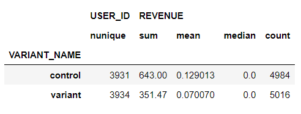
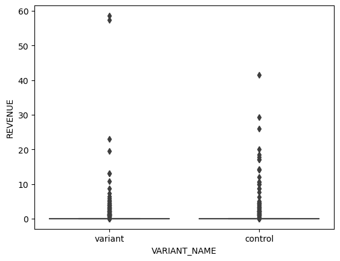
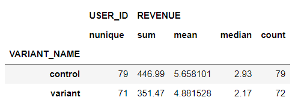
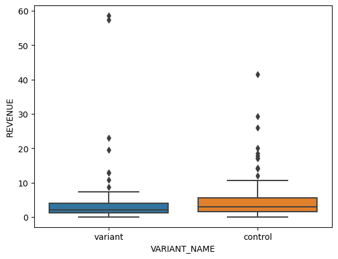
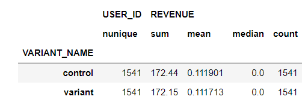
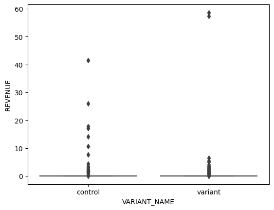

# A/B Testing

## Overview

- A/B testing compares the performance of two versions of content to see which one appeals more to visitors/viewers.
- It takes a control (A) version against a variant (B) version to measure which one is most successful based on your key metrics.
- A/B testing plays an important role in campaign management since it helps determine what is and isn't working. It allows you to compare and contrast the performance of two different approaches to identify the better one.

**A/B Testing Steps:**
- Understanding business problem & data
- Detect and resolve problems in the data (Missing Value, Outliers, Unexpected Value)
- Look summary stats and plots
- Apply hypothesis testing and check assumptions
    - Check Normality & Homogeneity
    - Apply tests (Shapiro, Levene Test, T-Test, Welch Test, Mann Whitney U Test)
- Evaluate the results
- Make inferences
- Recommend business decision to your customer/director/ceo etc.

 

**Data Dictionary**

| Variable | Definition |
| --- | --- |
| USER_ID | Unique ID for the customer |
| VARIANT_NAME | {variant, control} represent different user group |
| REVENUE | Numeric data, with number range from 0 to a positive number |

 

In this dataset, we will perform test on three perspectives:

(1) **All users:** The whole dataset

(2) **Paid users:** Filter the dataset with only paid user

(3) **Multiple visit users:** Filter the dataset with users that have multiple visits

 

## Section 1. Analyze the entire user group

We want to first analyze the entire dataset. We found no missing value from the dataset. However, there are some users that have multiple records in the dataset. It indicates the users might visited the website multiple times before making purchases.

our target variable is "REVENUE". Therefore, we will plot to understand the distribution of the revenue in different user groups. We first remove the extreme outlier value, which is near $200 revenue for a single user.

The statistics for the dataset is shown below:

The revenue distribution for the entire dataset is shown below:

As we can see, there are many users with 0 revenue, and there are some users with positive revenue.

### A/B Test on the entire user group

We perform a hypothesis test for the entire dataset:
- 𝐻0: There is no difference in the mean revenue between variant and control.
- 𝐻𝐴: There is a difference in the mean revenue between variant and control.

Both group A and group B are not normally distributed, therefore, we use a non-parametric test (Mann-Whitney U test method). 

The p-value of the test is 0.5292. Since the p-value > 0.05, we failed to reject H0. 

## Section 2. Analyze the paid user group dataset

Then, we filter out the users with positive revenue. We want to study if the control is effective for this user group.

The statistics for the dataset is shown below:

The revenue distribution for the dataset is shown below:

As we can see, the control group seems having a higher mean and third quantile as compared to the variant group. We will perform a hypothesis testing on them.

### A/B Test on the paid user group 

We perform a hypothesis test for the paid user group:
- 𝐻0: There is no difference in the mean revenue between variant and control.
- 𝐻𝐴: There is a difference in the mean revenue between variant and control.

Both group A and group B are not normally distributed, therefore, we use a non-parametric test (Mann-Whitney U test method). 

The p-value of the test is 0.1015. Since the p-value > 0.05, we failed to reject H0. 

## Section 3. Analyze the user group with multiple visits

Then, we filter out the users with multiple visits. We want to study if the control is effective for this user group.

The statistics for the dataset is shown below:

The revenue distribution for the dataset is shown below:

As we can see, the revenue distribution looks alike with the dataframe in the first section.

### A/B Test on the multiple visit user group 

We perform a hypothesis test for the multiple visit user group:
- 𝐻0: There is no difference in the mean revenue between variant and control.
- 𝐻𝐴: There is a difference in the mean revenue between variant and control.

Both group A and group B are not normally distributed, therefore, we use a non-parametric test (Mann-Whitney U test method). 

The p-value of the test is 0.6958. Since the p-value > 0.05, we failed to reject H0. 

 

## Section 4. Conclusion

The result is summarized in the table below:

| Scenario | Test Type | P value | Result | Remark |
| --- | --- | --- | --- | --- |
| Test on the entire user group | Non-parametric | 0.529197 | Failed to reject H0 | A/B groups are similar |
| Test on the paid user group	 | Non-parametric | 0.101459 | Failed to reject H0 | A/B groups are similar |
| Test on the user group with multiple visits | Non-parametric | 0.695758 | Failed to reject H0 | A/B groups are similar |

In all three scenarios, our hypothesis tests show results of failed to reject H0. Therefore, we can conclude that in all scenarios, A/B groups are similar, and the controls are not effective.
