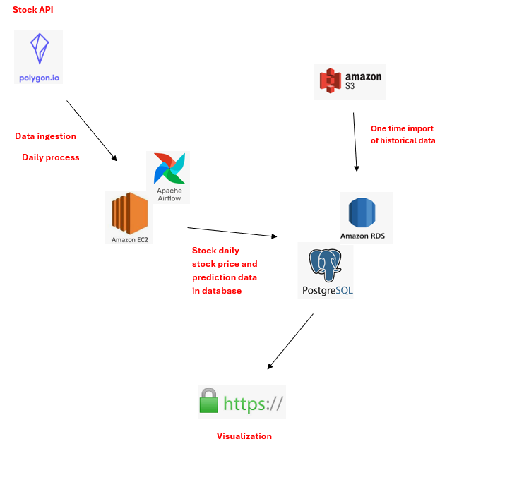
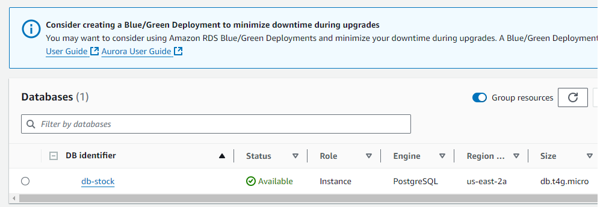
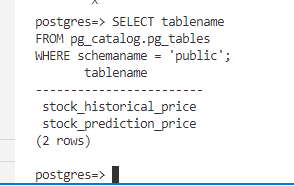
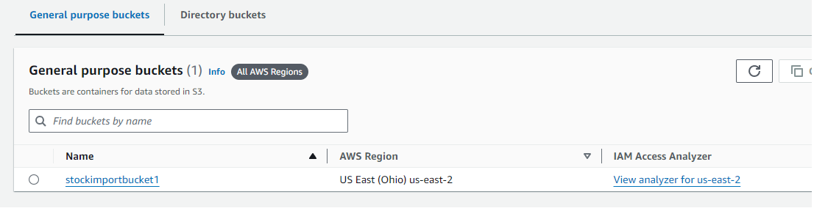
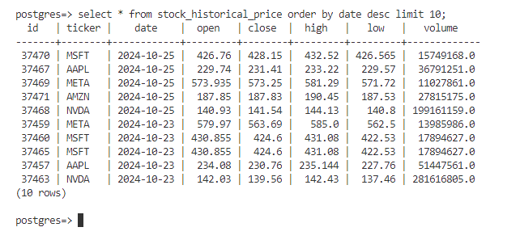
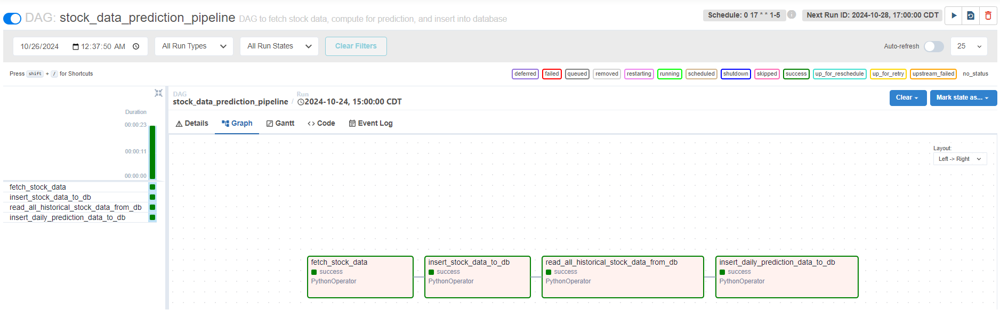
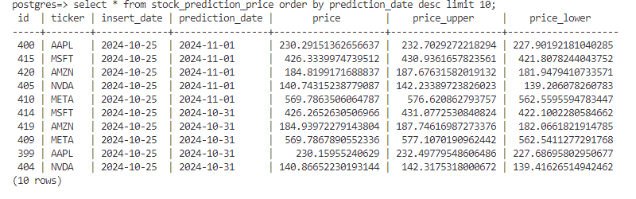
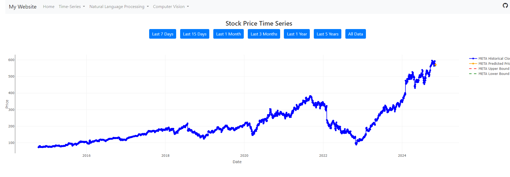

# Stock Price Prediction ETL Project

**Overview:** The purpose of this project is to perform stock price prediction for the next 5 days using the previous stock price. The Airflow is set up using the EC2 instance and the historical and prediction data is stored in PostgresSQL database using Amazon RDS. The historical and the prediction stock price can be visualized on my personal website.

 

**Keyword:** Airflow, Prophet, AWS (EC2, S3, RDS)

 

**API Link:** https://polygon.io/stocks

 

**Model Link:** https://facebook.github.io/prophet/

 

**Project File Links:**
- <a href="dag.py">dag.py</a>

 

**Project Mapflow:**

 

**Project Steps:**
1. Set up Amazon RDS (PostgresSQL Database)
2. Create EC2 instance (ubuntu) and set up airflow in the instance. Also, set up PostgreSQL in the instance.  
3. Set up dag.py to configure the DAG on Airflow.
4. Run the pipeline.
5. Visualization.

 

### Step 1. Set up Amazon RDS (PostgresSQL Database)
In this part, we will set up the Amazon RDS database to store data.

 

### Step 2. Create EC2 instance and set up Airflow and PostgreSQL
In this part, we will create an EC2 instance and set up airflow in the instance. Also, set up PostgreSQL in the instance.

 

We created two tables in the PostgreSQL database: (1) stock_historical_price, (2) stock_prediction_price. The stock_historical_price table is to store the historical stock price so that the algorithm can read and process the data, whereas the stock_prediction_price table is to store the prediction price. After that, do a batch import to import historical data to the PostgrelSQL database using s3 bucket.

 

### Step 3. Set up dag.py to configure the DAG on Airflow
In this part, we will set up dag.py to automate data retrieval using API and store data into stock_historical_price table. Then, read data from stock_historical_price table and use as an input to the Prophet algorithm for making prediction in the next 5 days. Lastly, import the prediction data into stock_prediction_price table. 

 

### Step 4. Run the pipeline
In this part, we will trigger the pipeline. The result shows the prediction data is imported to the stock_prediction_price table. After that, we will create a airflow-scheduler.service and airflow-webserver.service files to automate the processes.

 

### Step 5. Visualization
Lastly, the historical price from stock_historical_price table and the prediction price from the stock_prediction_price table is used to build a dashboard on my personal website. The dashboard is built using Plotly.js.

