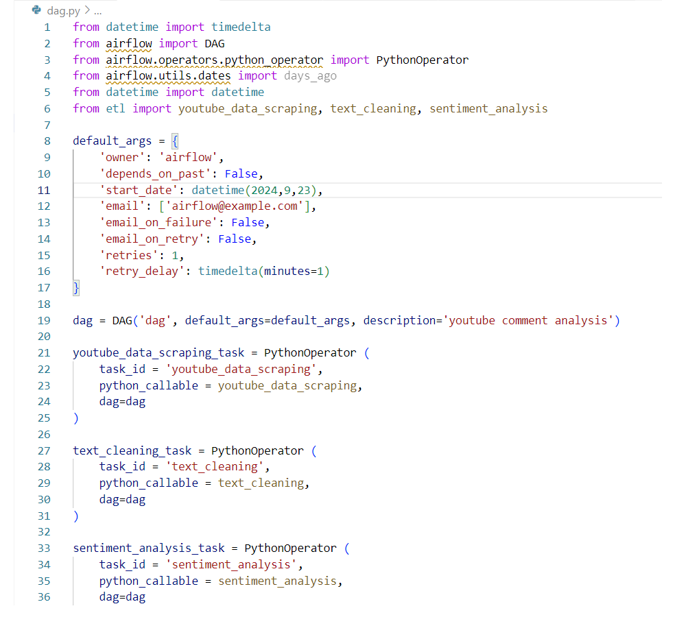
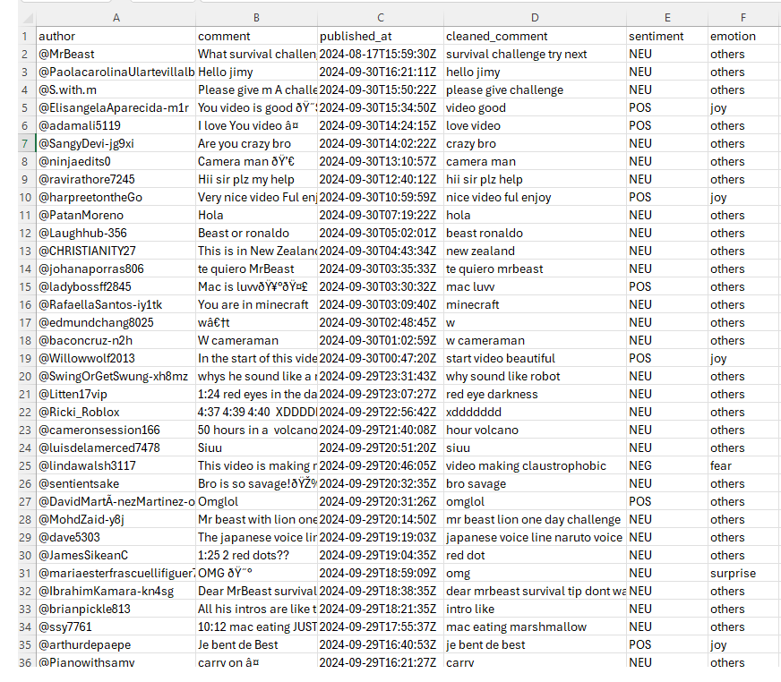

## Youtube Comments Scraping ETL Project

**Project Overview:** This project is to demonstrate the ability to set up the ETL pipeline on Airflow on AWS cloud to automate scraping youtube comments using API.

 

**API Link:** https://developers.google.com/youtube/v3/getting-started
* This project uses the Youtube comments api in the link.

 

**Youtube Video Link:** https://www.youtube.com/watch?v=ndAQfTzlVjc
* We will be using Mr. Beast's video of 7 days stranded in a cave.

 

**Project File Links:**
- <a href="etl.py">etl.py</a>
- <a href="dag.py">dag.py</a>

 

**Project Steps:**
1. Set up an etl.py to scrape the youtube comments data using REST API.
2. Set up a dag.py to configure the DAG on Airflow.
3. Create EC2 instance (ubuntu) and S3 bucket.
4. Connect to EC2 instance, install and configure Airflow.
5. Run the pipeline.

 

### Step 1. Set up etl.py
In this step, we will configure the api to scrape the youtube comments data. We are particularly interested to the **aurthor name**, **comment**, and **publish time**. Then, we will create a dataframe to insert the data, and import them to a csv file.

 

### Step 2. Set up dag.py
In this step, we will configure the settings for the Airflow.

 

### Step 3. Create EC2 instance and S3 bucket
In this step, we will set up the EC2 and S3 bucket.

 

### Step 4. Connect to the EC2 instance, install and configure Airflow
In this step, we will connect to the EC2 instance, then we will install and configure the Airflow in the environment.

 

### Step 5. Run the Pipeline
We will run the Airflow on the EC2 instance. The image shows the Airflow interface and the DAG graph:

 

Once we run the pipeline, the results will show on S3 bucket with a comments.csv file.

