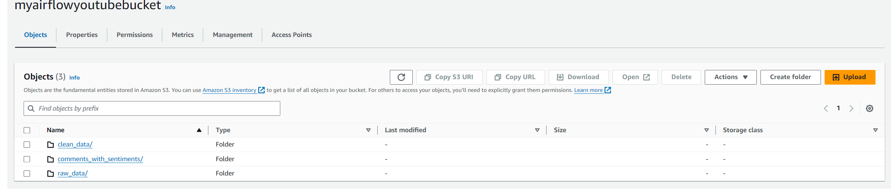
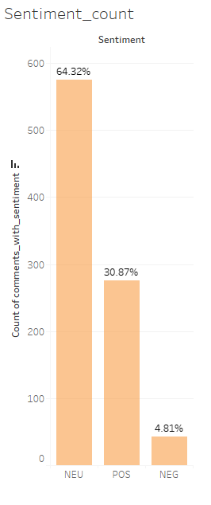
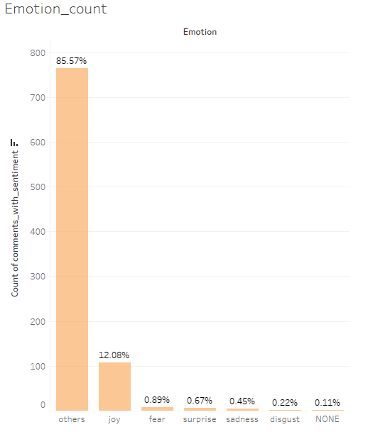

## Youtube Comments Scraping ETL Project

**Project Overview:** This project is to to set up the ETL pipeline on Airflow using AWS cloud console to automate scraping youtube comments using API. Then, a sentiment analysis and emotion analysis will be performed on these comments using a pretrained BERT LLM model. The result will be shown using a Tableau Dashboard.

 

**API Link:** https://developers.google.com/youtube/v3/getting-started
* This project uses the Youtube comments api in the link.

 

**Youtube Video Link:** https://www.youtube.com/watch?v=ndAQfTzlVjc
* We will be using Mr. Beast's video of 7 days stranded in a cave.

 

**Hugging Face LLM Model Link:** https://huggingface.co/finiteautomata/bertweet-base-sentiment-analysis
* We will be using a pretrained BERT model for this project.

 

**Project File Links:**
- <a href="etl.py">etl.py</a>
- <a href="dag.py">dag.py</a>

 

**Project Steps:**
1. Set up an etl.py, include:
- Web scraping for youtube comments data using API.
- Data Cleaning for text.
- Integrate a hugging face LLM model (BERT) for sentiment analysis.
2. Set up a dag.py to configure the DAG on Airflow.
3. Create EC2 instance (ubuntu) and S3 bucket.
4. Connect to EC2 instance, install and configure Airflow, import libraries.
7. Run the pipeline.

 

**Project Mapflow:**

 

### Step 1. Set up etl.py
In this step, we will configure the api to scrape the youtube comments data. We are particularly interested to the **aurthor name**, **comment**, and the **publish time**. Then, we will create a dataframe to insert the data, and import them to a csv file.

 

### Step 2. Set up dag.py
In this step, we will configure the settings for the Airflow.

 

### Step 3. Create EC2 instance and S3 bucket
In this step, we will set up the EC2 and S3 bucket.

 

### Step 4. Connect to the EC2 instance, install and configure Airflow
In this step, we will connect to the EC2 instance, then we will install and configure the Airflow in the environment.

 

### Step 5. Run the Pipeline
We will run the Airflow on the EC2 instance. The image shows the Airflow interface and the DAG graph:

 

Once we run the pipeline, the results will show on S3 bucket with a comments.csv file.

 

After that, we can connect S3 to Amazon Athena, and create an external table in Amazon Athena so that it can be analyzed using SQL, and it can be connected to Tableau.

 

In the last step, we set up Tableau using Aamazon Athena as a data source. We build a dashboard for the sentiment count and the emotional count. 

From the chart, we can see that the the distribution of sentiment and emotion are: 
- 64% neutral, 31% positive, and 5% negative.
- 86% others, 12% joy, 1% fear 0.7% surprise, 0.5% sadness, 0.2% disgust.
We can conclude that the comments for this youtube video leans towards positive side.

