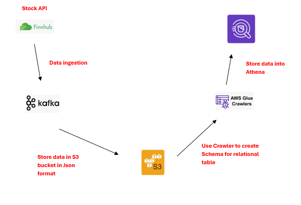

## Real-time Stock API Apache Kafka ETL Pipeline

**Project Overview:** This project integrated real-time stock data from the Finnhub API with an Apache Kafka-based architecture to build a robust data ingestion pipeline. Kafka acted as the messaging system for streaming live trade data, enabling a scalable and fault-tolerant mechanism for capturing financial information in real time.

 

**API Link:** 
- https://finnhub.io/
- We will be using the real-time websocket api.

 

**Project File Links:**
- <a href="etl.py">etl.py</a>

 

**Project Workflow:**

 

**Project steps:**
**1. Data Ingestion Using Finnhub API:**
- The project began by utilizing the Finnhub Stock API to gather real-time financial data, particularly stock prices and trade information.
- A WebSocket connection was established to continuously receive stock market trade data for specific symbols (e.g., BTC/USDT).
- The incoming data was parsed and processed using Python.
**2. Apache Kafka Setup:**
- Apache Kafka was configured as the streaming platform to handle real-time data ingestion.
- A Kafka producer was created to send parsed trade data from the Finnhub API to a Kafka topic.
- A Kafka consumer was also configured to consume data from this topic in real-time for further downstream processing.
**3. Storing Real-Time Data in AWS S3:**
- Data consumed from the Kafka topic was streamed into AWS S3 for storage.
- The data was partitioned and organized in JSON format, making it suitable for further analysis and querying.
- AWS S3 served as a reliable and scalable storage solution for retaining real-time stock data.
**4. Setting Up AWS Glue Crawler:**
- An AWS Glue Crawler was set up to crawl the data in the S3 bucket and automatically generate metadata in AWS Glue Data Catalog.
- This cataloged data enabled structured querying of the stock data using AWS Athena.
- The Glue Crawler ensured the data remained up-to-date as new records were added to S3.
**5. Querying Data Using AWS Athena:**
- AWS Athena was leveraged to run SQL queries directly on the data stored in S3.
- With the Glue catalog in place, Athena made it possible to quickly analyze stock data for deeper insights without requiring complex ETL processes.

