# Overview: Azure data engineering project for Olympic Paris 2024 dataset 

**Goal:** The goal of this project is to demonstrate using tools on Microsoft Azure portal to build end-to-end data pipeline. The process is shown in the image below.

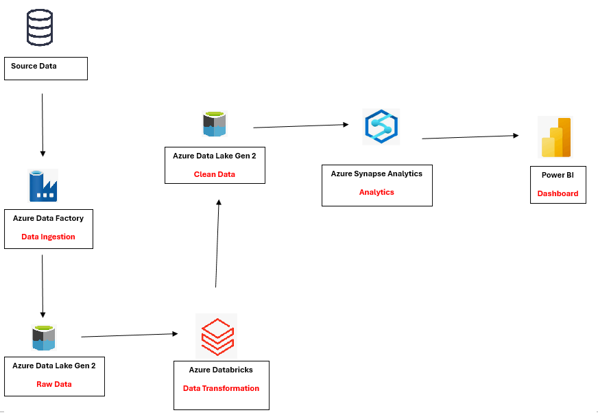

We use a variety of tools on Microsoft Azure for this project. The process started from using **Azure Data Factory** to ingest raw data from the source. After the data ingestion, the raw data is stored in the **Azure Data Lake Gen2**. Then, we use **Azure Databricks** to perform data cleaning and data transformation. We will store the clean data into the **Azure Data Lake Gen2**. After that, we connect the **Azure Data Lake Gen2** with the **Azure Synapse Analytics** to perform SQL-based analytics. Finally, we will use **PowerBI** for dashboard and reporting.

## 1. Azure Data Factory

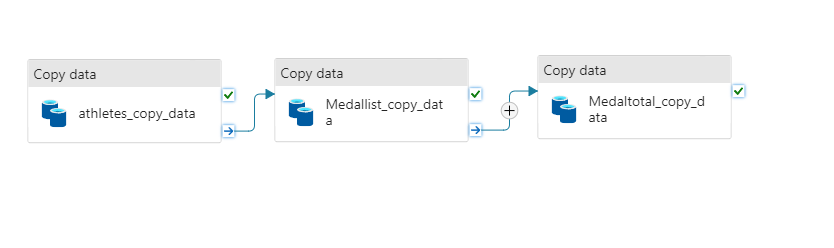

In this part, we use Azure Data Factory to ingest data from the source. We create multiple copy activites in the pipeline to copy data from the source to sink (Azure Data Lake Stirage Gen2). 

## 2. Azure Data Lake Storage Gen2

We set up a raw and a transformed folders in the container. The raw folder is used to store the raw data, while the transformed folder is used to store the cleaned data.

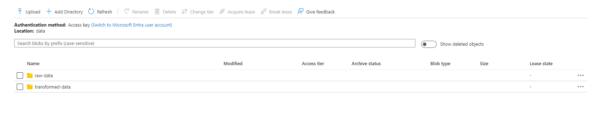

The files in the raw data folder is shown below:

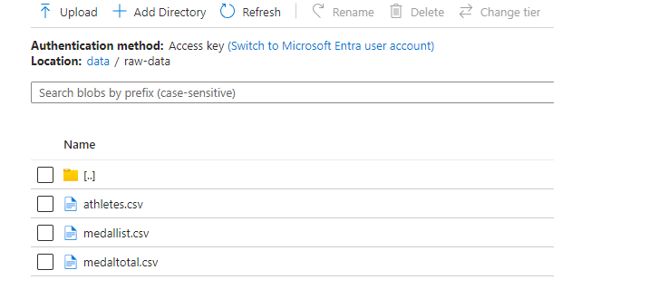

## 3. Azure Databricks

In this part, we load the raw data into Azure databricks environment and perform data cleaning and data transformation.

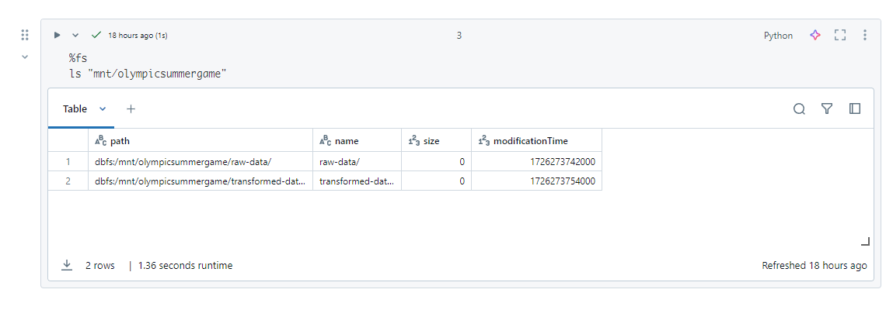
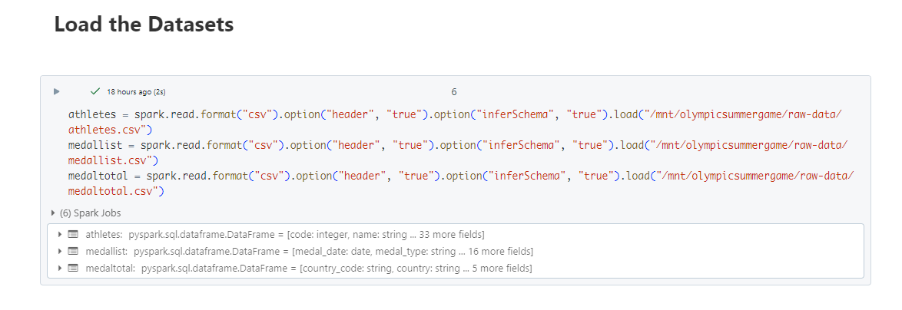

After the data cleaning and data transformation is completed for all the dataset, they are saved in the transformed folder in the Azure Data Lake Storage Gen2 in parquet format.
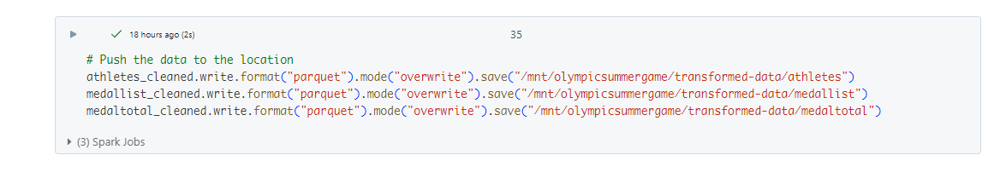

## 4. Azure Data Lake Storage Gen2

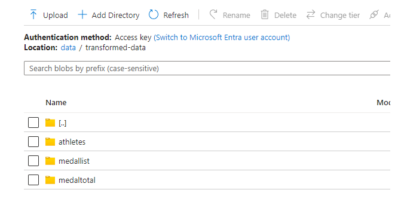
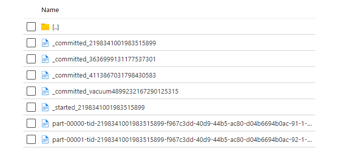

## 5. Azure Synapse Analytics

In this part, we built three external tables in the SQL database in Azure Synapse Analytics. Then, we are able to perform SQL-based anlytics to get analytics insights.

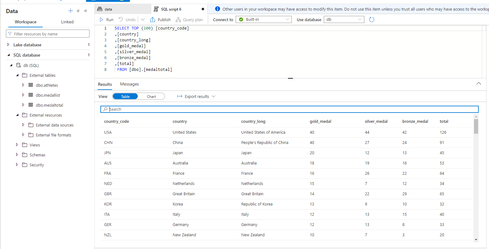

## 6. PowerBI

In this part, we build dashboard for reporting using PowerBI. The visualization dashboard helps us to bring insights from the dataset.

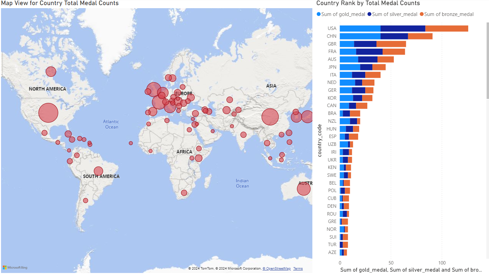

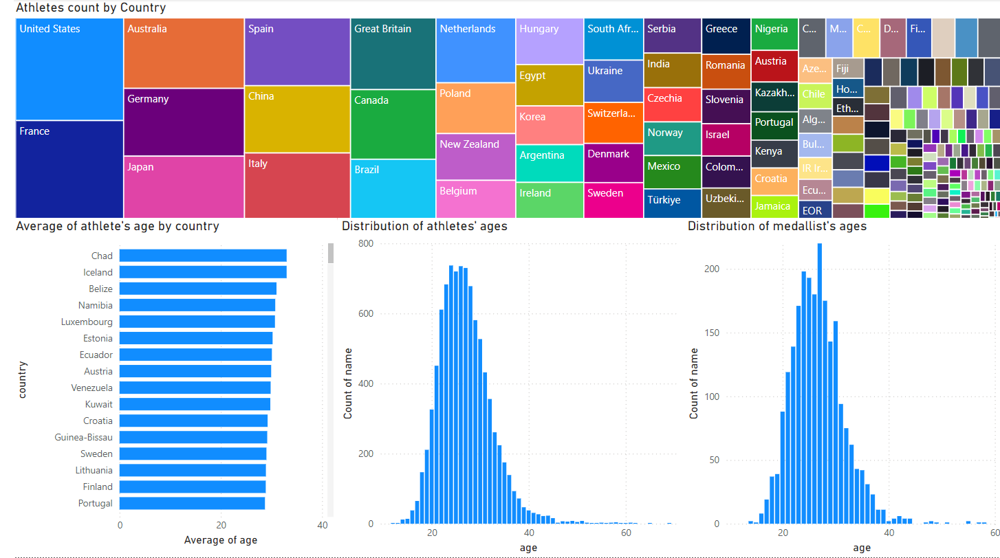

## Conclusion

The Azure Data Engineering project successfully demonstrated the capabilities of Azure's ecosystem to design and implement a scalable, secure, and efficient data pipeline. By leveraging **Azure Data Factory** for data ingestion, **Azure Data Lake Storage Gen2** for scalable data storage, **Azure Databricks** for data transformation, **Azure Synapse Analytics** for analysis, and **PowerBI** for dashboard and reporting, the project provided a robust framework for ingesting, processing, and visualizing large datasets in near real-time.
