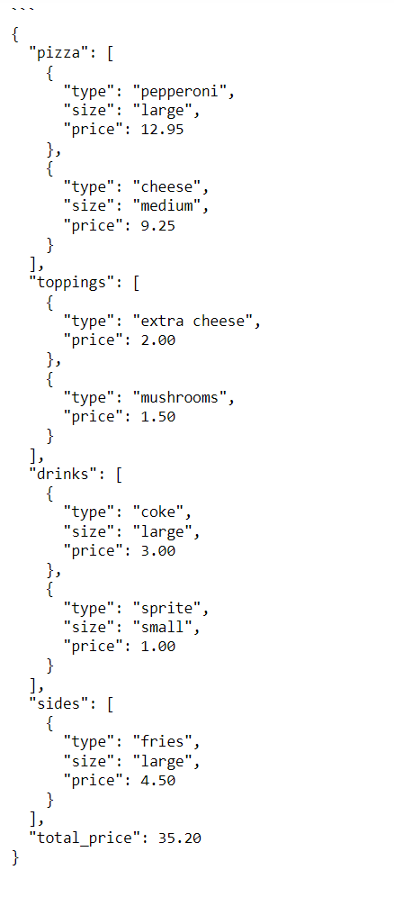

## ChatGPT Prompt Engineering for Developers 
### Course Sections:

1. Introduction </br>
2. Guidelines </br>
3. Iterative </br>
4. Summarizing </br>
5. Inferring </br>
6. Transforming </br>
7. Expanding </br>
8. Chatbox </br>

## Section 1: Introduction
### Two types of large language models (LLMs)

1) **Base LLM:** Predicts next word, based on text training data

</br>

   Example:

    Input: Once upon a time, there was a unicorn

    Output: that lived in a magical forest with all her unicorn friends

</br>

2) **Instruction Tuned LLM:** Tries to follow instructions, fine-tune on instructions and good attempts at following those instructions.

RLHF: Reinforcement learning with Human Feedback 

</br>

  Example:

     Input: What is the capital of France?

     Output: The capital of France is Paris
     
     
### To install chatGPT

      !pip install openai
      

## Section 2: Guidelines

### Two Principles of Prompting

</br>

#### Principle 1: Write clear and specific instructions

**Tactic 1:** Use delimeters

```
    Triple quotes: """
    Triple backticks: ```
    Triple dashes: ---
    Angle brackets: <>
    XML tags: <tag> </tag>
```

**Tactic 2:** Ask for structured output

```
HTML, JSON
```

**Tactic 3:** Check whether conditions are satisfied 

```
Check assumptions required to do the task
```


**Tactic 4:** Few-shot prompting

```
Give successful examples of completing task, then ask model to perform the task
```

</br>

#### **Principle 2: Give the model time to think**

**Tactic 1:** Specify the steps to complete a task

```
    Step 1: ...
    Step 2: ...
    ...
    Step N: ...
```

**Tactic 2:** Instruct the model to work out its own solution before rushing to a conclusion

</br>

### Model Limitations

</br>

**Hallucination:** Makes statements that sound plausible but are not true

**Reducing hallucinations:** First find relevant information, then answer the question based on the relevant information


</br>


## Section 3: Iterative

### Iterative Prompt Development

**Prompt Guidelines:**
```
- Be clear and specific
- Analyze why result does not give desired output.
- Refine the idea and the prompt.
- Repeat.
```
</br>

**Iterative Process:**
```
- Try something.
- Analyze where the result does not give you what you want.
- Clarify instructions, give more time to think.
- Refine prompts with a batch of examples.
```


## Section 4: Summarizing


## Section 5: Inferring


## Section 6: Transforming


## Section 7: Expanding

ChatGPT can be used to generate customer service emails that are tailored to each customer's review.

```
# given the sentiment from the lesson on "inferring",
# and the original customer message, customize the email
sentiment = "negative"

# review for a blender
review = f"""
So, they still had the 17 piece system on seasonal \
sale for around $49 in the month of November, about \
half off, but for some reason (call it price gouging) \
around the second week of December the prices all went \
up to about anywhere from between $70-$89 for the same \
system. And the 11 piece system went up around $10 or \
so in price also from the earlier sale price of $29. \
So it looks okay, but if you look at the base, the part \
where the blade locks into place doesn’t look as good \
as in previous editions from a few years ago, but I \
plan to be very gentle with it (example, I crush \
very hard items like beans, ice, rice, etc. in the \ 
blender first then pulverize them in the serving size \
I want in the blender then switch to the whipping \
blade for a finer flour, and use the cross cutting blade \
first when making smoothies, then use the flat blade \
if I need them finer/less pulpy). Special tip when making \
smoothies, finely cut and freeze the fruits and \
vegetables (if using spinach-lightly stew soften the \ 
spinach then freeze until ready for use-and if making \
sorbet, use a small to medium sized food processor) \ 
that you plan to use that way you can avoid adding so \
much ice if at all-when making your smoothie. \
After about a year, the motor was making a funny noise. \
I called customer service but the warranty expired \
already, so I had to buy another one. FYI: The overall \
quality has gone done in these types of products, so \
they are kind of counting on brand recognition and \
consumer loyalty to maintain sales. Got it in about \
two days.
"""
```
```
prompt = f"""
You are a customer service AI assistant.
Your task is to send an email reply to a valued customer.
Given the customer email delimited by ```, \
Generate a reply to thank the customer for their review.
If the sentiment is positive or neutral, thank them for \
their review.
If the sentiment is negative, apologize and suggest that \
they can reach out to customer service. 
Make sure to use specific details from the review.
Write in a concise and professional tone.
Sign the email as `AI customer agent`.
Customer review: ```{review}```
Review sentiment: {sentiment}
"""
response = get_completion(prompt)
print(response)
```

Output:
```
Dear Valued Customer,

Thank you for taking the time to leave a review about our product. We are sorry to hear that you experienced an increase in price and that the quality of the product did not meet your expectations. We apologize for any inconvenience this may have caused you.

We would like to assure you that we take all feedback seriously and we will be sure to pass your comments along to our team. If you have any further concerns, please do not hesitate to reach out to our customer service team for assistance.

Thank you again for your review and for choosing our product. We hope to have the opportunity to serve you better in the future.

Best regards,

AI customer agent
```

We can use the parameter "temperature" to adjust the randomness of the response

```
prompt = f"""
You are a customer service AI assistant.
Your task is to send an email reply to a valued customer.
Given the customer email delimited by ```, \
Generate a reply to thank the customer for their review.
If the sentiment is positive or neutral, thank them for \
their review.
If the sentiment is negative, apologize and suggest that \
they can reach out to customer service. 
Make sure to use specific details from the review.
Write in a concise and professional tone.
Sign the email as `AI customer agent`.
Customer review: ```{review}```
Review sentiment: {sentiment}
"""
response = get_completion(prompt, temperature=0.7)
print(response)
```

Output:
```
Dear Valued Customer,

Thank you for taking the time to leave a review for our 17 piece system. We are sorry to hear that you were not satisfied with the pricing and quality of the product. We apologize for any inconvenience this may have caused you.

Please know that we take your feedback seriously and will do our best to improve our products and services. If you have any further concerns, please do not hesitate to reach out to our customer service team. They will be more than happy to assist you.

Thank you again for your feedback and for choosing our product. We hope to have the opportunity to serve you better in the future.

Sincerely,

AI customer agent
```


## Section 8: Chatbot

Three roles in the messages
```
1. System: Sets behavior of assistant
2. Assistant: Chat model
3. User: You
```

### Chatbot

Example:
```
messages =  [  
{'role':'system', 'content':'You are friendly chatbot.'},    
{'role':'user', 'content':'Hi, my name is Isa'}  ]
response = get_completion_from_messages(messages, temperature=1)
print(response)
```
Output: Hi Isa! How can I assist you today?

</br>

Example:
```
messages =  [  
{'role':'system', 'content':'You are friendly chatbot.'},
{'role':'user', 'content':'Hi, my name is Isa'},
{'role':'assistant', 'content': "Hi Isa! It's nice to meet you. \
Is there anything I can help you with today?"},
{'role':'user', 'content':'Yes, you can remind me, What is my name?'}  ]
response = get_completion_from_messages(messages, temperature=1)
print(response)
```
Output: Of course, your name is Isa!

</br>

### Orderbot

Automate the collection of user prompt and assistant responses to build a OrderBot.

```
User:

Assistant:

Hello! Welcome to our pizza restaurant. What can I get for you today?

User:

hello I would like to order a p

Assistant:

Hi there! I’m sorry, I didn’t quite catch that. Could you please let me know what you would like to order?

User:

hello I would like to order a p

Assistant:

I’m sorry, I’m still not sure what you’re trying to order. Could you please let me know which item you would like to order from our menu? We have pepperoni pizza, cheese pizza, eggplant pizza, fries, greek salad, and a variety of toppings and drinks.

User:

hello I would like to order a pizza

Assistant:

Great! Which type of pizza would you like to order? We have pepperoni pizza, cheese pizza, and eggplant pizza.

User:

pepperoni pizza with cheese

Assistant:

Sure thing! What size would you like for your pepperoni pizza with cheese? We have small for $7.00, medium for $10.00, and large for $12.95.

User:

large

Assistant:

Got it! Would you like any additional toppings on your large pepperoni pizza with cheese? We have extra cheese for $2.00, mushrooms for $1.50, sausage for $3.00, Canadian bacon for $3.50, AI sauce for $1.50, and peppers for $1.00.

User:

sausage

Assistant:

Great choice! Is there anything else you would like to order or add to your large pepperoni pizza with cheese and sausage? We also have fries, greek salad, and a variety of drinks available.

User:

fries

Assistant:

Sure thing! Would you like a small or large order of fries? Our small fries are $3.50 and our large fries are $4.50.

User:

large

Assistant:

Got it! Is there anything else you would like to order or add to your large pepperoni pizza with cheese and sausage and large fries? We also have greek salad and a variety of drinks available.

User:

nope

Assistant:

Alright then! So, just to confirm, you would like to order a large pepperoni pizza with cheese and sausage, and a large order of fries. Is that correct? Also, would you like to pick up your order or have it delivered?

User:

yes, i would like to pick up

Assistant:

Great! Your total comes out to $20.45. Please come to our restaurant located at 123 Main Street to pick up your order. Thank you for choosing our pizza restaurant!
```


Summarize the order as a json format and input to the system

```
{
  "pizza": [
    {
      "type": "pepperoni",
      "size": "large",
      "price": 12.95
    },
    {
      "type": "cheese",
      "size": "medium",
      "price": 9.25
    }
  ],
  "toppings": [
    {
      "type": "extra cheese",
      "price": 2.00
    },
    {
      "type": "mushrooms",
      "price": 1.50
    }
  ],
  "drinks": [
    {
      "type": "coke",
      "size": "large",
      "price": 3.00
    },
    {
      "type": "sprite",
      "size": "small",
      "price": 2.00
    }
  ],
  "sides": [
    {
      "type": "fries",
      "size": "large",
      "price": 4.50
    }
  ],
  "total_price": 35.20
}
```



