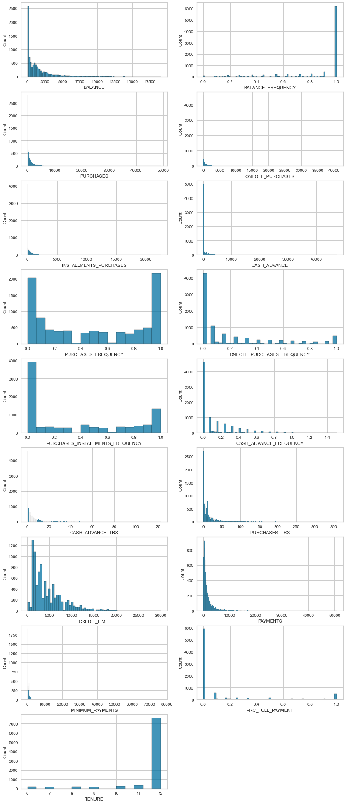
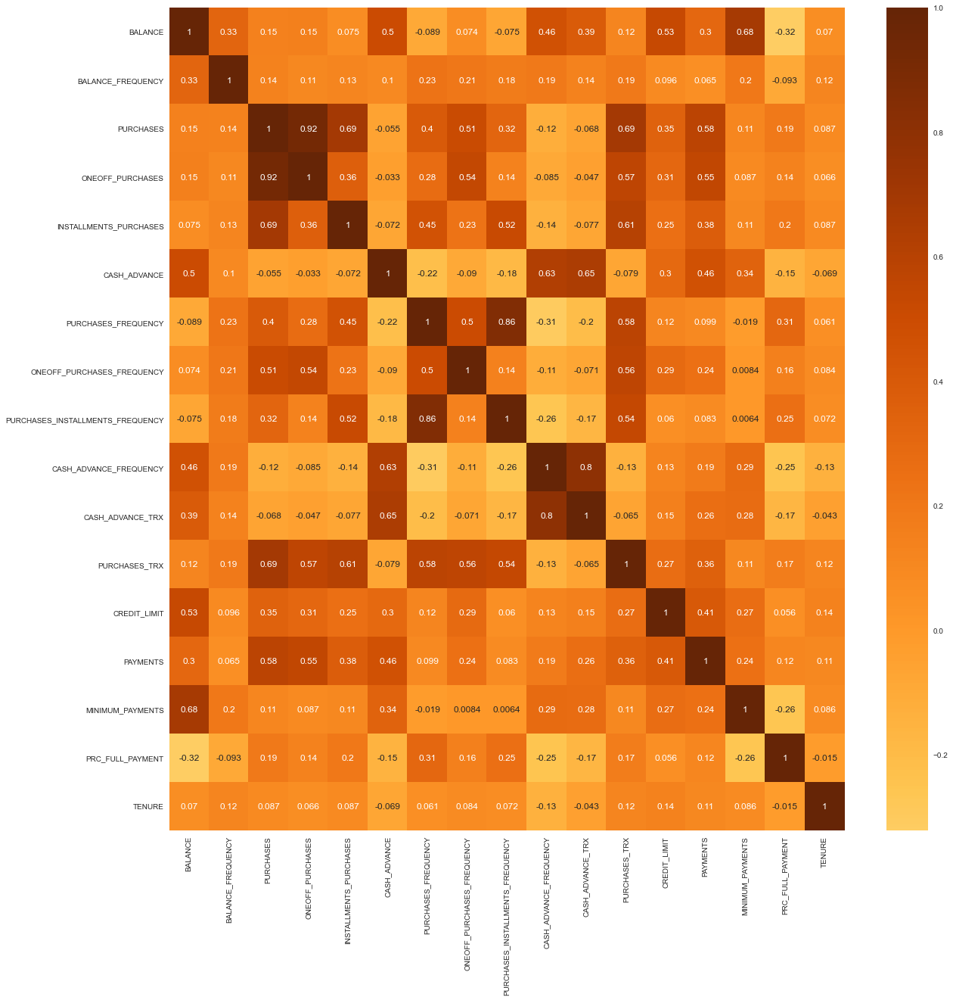
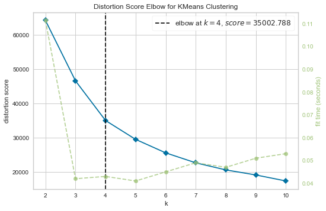
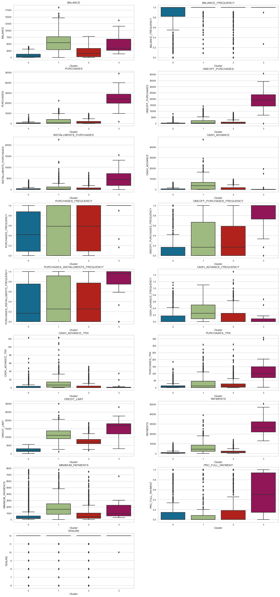
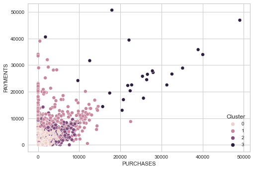
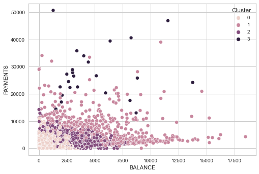

## Clustering analysis in a Credit Card customer dataset

**Project goal:** The goal of this project is to perform clustering analysis in a credit card customer dataset, which can provide business insights and values by using different marketing strategies to each customer groups.

### Columns in dataset

(1) CUST_ID  
(2) BALANCE  
(3) BALANCE_FREQUENCY  
(4) PURCHASES  
(5) ONEOFF_PURCHASES  
(6) INSTALLMENTS_PURCHASES  
(7) CASH_ADVANCE  
(8) PURCHASES_FREQUENCY  
(9) ONEOFF_PURCHASES_FREQUENCY  
(10) PURCHASES_INSTALLMENTS_FREQUENCY  
(11) CASH_ADVANCE_FREQUENCY  
(12) CASH_ADVANCE_TRX  
(13) PURCHASES_TRX  
(14) CREDIT_LIMIT  
(15) PAYMENTS  
(16) MINIMUM_PAYMENTS  
(17) PRC_FULL_PAYMENT  
(18) TENURE  

### Fill in Missing values

There are some missing values in the credit_limit and minimum payments columns. Due to these columns are numerical variables, I filled in the mean values in the missing rows.

### Plotting the columns

We can clearly see outliers in some columns.

### Removing outliers

I checked the mean and standard deviation of each columns. Then, the upper limit is calculated as [mean + 3 * standard deviation] and the lower limit is calculated as [mean - 3 * standard deviation]. The outliers are the rows that have values either lower than the lower limit or higher than the upper limit. There are a total of 102 outliers removed from this process.

### Correlation matrix

We can see there are some columns highly correlated with others, such as:  
(1) **oneoff purchases** is highly correlated with **purchases**  
(2) **purchases frequency** is highly correlated with **purchases installment frequency**  
(3) **cash advance frequency** is highly correlated with **cash advance trx**  

### Perform PCA for Dimension Reduction

In this clustering analysis, the PCA is used along to reduce the dimension of the data. I performed a PCA of n_component = 3 to the dataset.

### Clustering

The K Means method is used for the clustering analysis. The elbow method shows that n=4 performs the best result.

### Cluster Visualization

The customer counts of clusters are shown below: 

|Cluster|Counts|
| --- | ---|
| 0 | 5522 |
| 1 | 2578 |
| 2 | 724 |
| 3 | 24 |

The boxplots for each columns are plotted against clusters. This is to studies the customers properties in each of the clusters. The boxplots are shown below:

Moreover, some scatterplots are plotted to show the standing of clusters in:
(1) Purchases/Payments

(1) Balance/Payments

### Cluster Findings

These findings are from the visualization plots above.
|Cluster| Properties|
| --- | :--- | 
| **Cluster 0** | (1) Minimum balance |
|               | (2) Minimum purchases|
|               | (3) Low oneoff purchases frequency |
|               | (4) Medium installment purchases frequency |
|               | (5) Low cash advancement frequency |
|               | (6) Minimum credit limit |
|               | (7) Minimum payments |
| **Cluster 1** |(1) High balance |
|               |(2) Low to medium purchases |
|               |(3) Medium oneoff purchases frequency |
|               |(4) Medium installment purchases frequency |
|               |(5) Medium cash advancement frequency |
|               |(6) Medium to high credit limit |
|               |(7) Low to medium payments |
| **Cluster 2** |(1) Low balance |
|               |(2) Minimum purchases |
|               |(3) Medium oneoff purchases frequency |
|               |(4) Medium installment purchases frequency |
|               |(5) Low cash advancement frequency |
|               |(6) Medium credit limit |
|               |(7) Minimum payments |
| **Cluster 3** |(1) Medium balance |
|               |(2) High purchases |
|               |(3) High oneoff purchases frequency |
|               |(4) High installment purchases frequency |
|               |(5) Minimum cash advancement frequency |
|               |(6) Medium to high credit limit |
|               |(7) High payments |

### Conclusion

To summarize, **cluster 0** is the customer group that is inactive in using credit card to make purchases. They have minimum credit limit, minimum credit card balance, low purchases frequency, and minimum payment. There are 5522 customers in this group. **Cluster 1** is the customer group that have medium level in purchases. They have medium to high credit limit, but they have a low to medium level payments. So, they ended up have high credit card balance. There are 2578 customers in cluster 1. **Cluster 2** is the customer group that do not frequently use credit card to make purchases. They have a minimum level of purchases and payments, however, they have a medium level of credit limit. Also, they have a low credit card balance. There are 724 customers in cluster 2. **Cluster 3** is the active credit card user group that have high level of purchases and payments. They have a high level in both oneoff and installment purchases frequency, and they have a medium level of credit card balance. There are 24 customers in cluster 3.

The credit card company could make good earnings through the interest payments from customers in cluster 1. Moreover, they could make good earnings through the transaction fees from customers in cluster 3, as they have a high level of purchases frequency. Overall, the marketing team should develop strategies for the customers in these two clusters.
