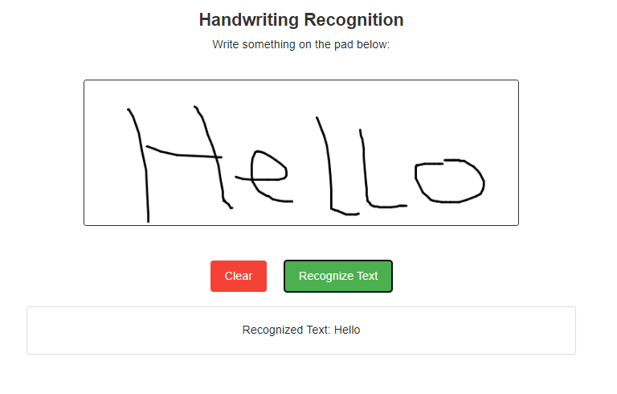

# Image to Text: Handwriting Recognition and Image Upload

**Overview:** This project aims to convert handwritten text in images into digital text using advanced handwriting recognition technology. By allowing users to upload images of handwritten notes, this tool processes and translates the visual text into machine-readable text, making it easy to digitize and search handwritten documents. Handwriting recognition combines computer vision and machine learning to interpret various handwriting styles and layouts. This project not only saves time and effort in manual transcription but also preserves valuable handwritten content in a digital format.

 

**Model Link:** https://huggingface.co/microsoft/trocr-large-handwritten

**Steps:**
1. First, we need to define the preprocessing functions. We implement a function (preprocess_image_ to prepare images for the OCR models, such as:
- **Grayscale Conversion:** Convert images to grayscale to reduce color complexity.
- **Contrast Adjustment:** Increase contrast to improve OCR accuracy.
- **Denoising:** Apply a median filter to reduce noise.
- **Resizing and Binarization:** Resize the image and convert to binary (black-and-white) to enhance text visibility.

 

2. Then, we build the ensemble OCR Function. We create an ensemble function (recognize_text_ensemble) to process the image with each OCR model. Each model processes the image, and the results are stored. Implement a simple majority voting system to select the most frequent recognized text output. 
- **TrOCR:** Uses a Transformer model for OCR, ideal for general text recognition.
- **EasyOCR:** Handles multiple languages and various text types; use a pre-trained English model.
- **PaddleOCR:** Provides support for angle correction and multilingual OCR.

 

3. The OCR models are integrated in the Flask Route, and the HTML templates are created for user interface.

 

# Handwriting Recognition
The user input text in the writing pad, and the processed text will be generated.

# Image Upload
The user upload image, and the processed text will be generated.

