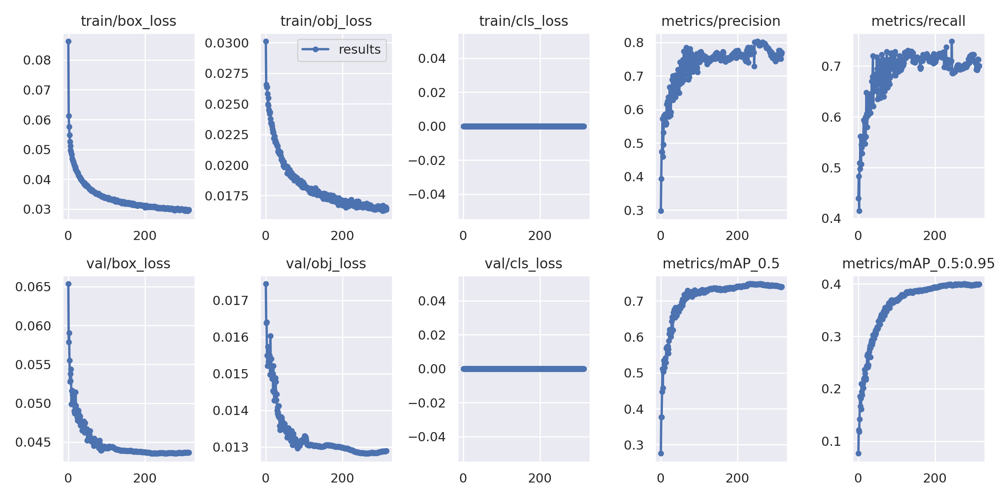
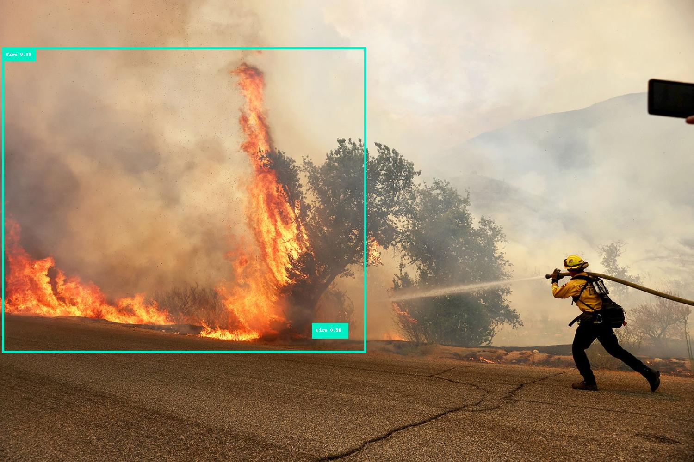

<h1>Fire Detection Projection using Roboflow</h1>

**URL:** https://app.roboflow.com/chong-yaow-hui-henfg/fire-detection-wfdhl/1

**bold text:** The goal of this project is to build a fire detector using Yolov8 algorithm on Roboflow. 

**Background:** Yolov8 is a state-of-the-art YOLO Model developed by Ultralytics, which is specialized in computer vision tasks such as real-time object detection, classification, and segmentation. Compared to the previous generations of YOLO Models, Yolov8 is faster, more accurate, and simpler. Fore more details, please read: https://ultralytics.com/yolov8

**Dataset:** There are total of 3,284 fire images, which are then split into 2,628 training images, 328 validation images, and 328 test images.

**Preprocessing:** All images are resized to 640x 640.

**Data Augmentation:** Data Augmentation techniques are applied to increasing training accuracy. The applied techniques are:
  (1) Horizontal flip, 
  (2) 0-12% Random Crop, 
  (3) -10° to +10° Random Rotation.

**Generate** A total of 8,540 images are generated after the data augmentation process.

**Training Result:** The model training result has a 74.8% mAP, 79.7% precision, and 70.2% recall.

**Statistics Plot:**

**Result**

