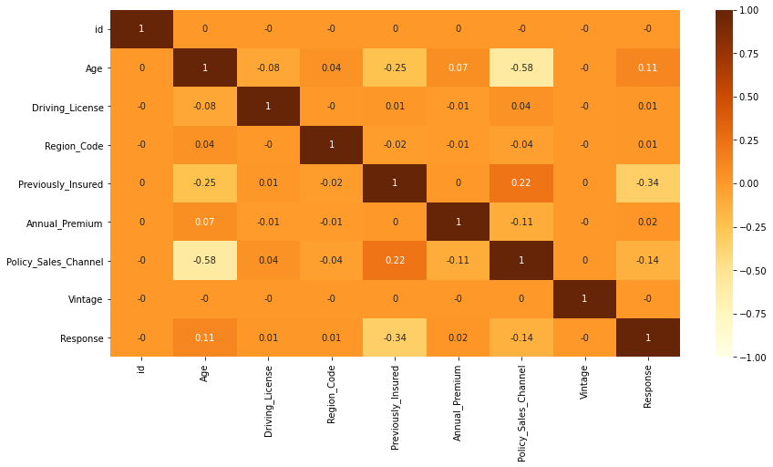
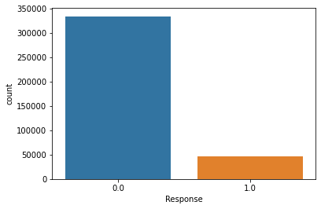
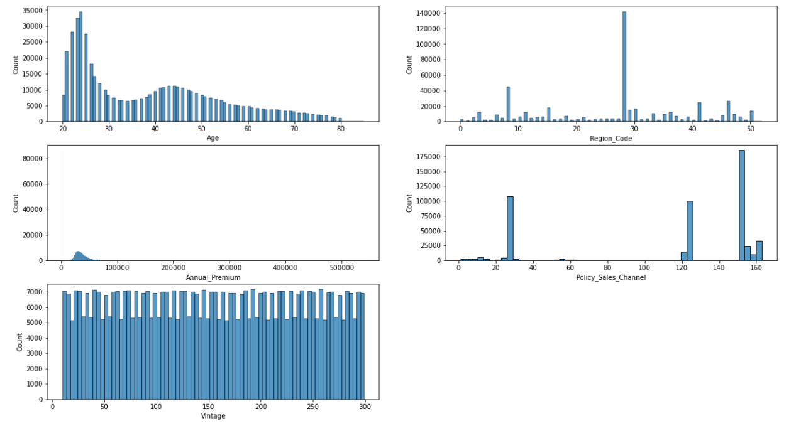
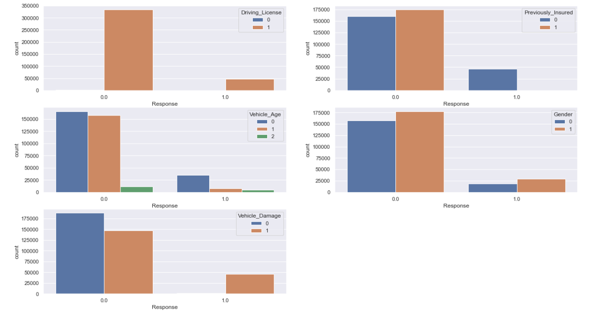
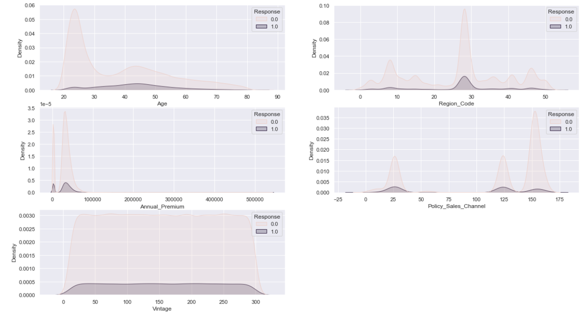

## Health Insurance Cross Sell Prediction

### Section 1: Project Overview

**Project Goal:** Predict Health Insurance Owners' who will be interested in Vehicle Insurance

 

**Data source:** https://www.kaggle.com/datasets/anmolkumar/health-insurance-cross-sell-prediction

 

**Description:** This project is to build a model to predict whether a health insurance owner would be interested in purchasing a Vehicle Insurance. The prediction is helpful because company can plan its communication strategy to reach out to those customers and optimize its business model and revenue.

 

**Data Dictionary:**

| Variable | Definition |
| --- | --- |
| id | Unique ID for the customer |
| Gender | Gender of the customer |
| Age | Age of the customer |
| Driving_License | 0: Customer does not have DL, 1: Customer already has DL |
| Region_Code | Unique code for the region of the customer |
| Previously_Insured | 1: Customer already has Vehicle Insurance, 0: Customer doesn't have Vehicle Insurance |
| Vehicle_Age | Age of the Vehicle |
| Vehicle_Damage | 1: Customer got his/her vehicle damaged in the past. 0: Customer didn't get his/her vehicle damaged in the past |
| Annual Premium | The amount customer needs to pay as premium in the year |
| PolicySalesChannel | Anonymized Code for the channel of outreaching to the customer ie. Different Agents, Over Mail, Over Phone, In Person, etc. |
| Vintage | Number of Days, Customer has been associated with the company |
| Response | 1: Customer is interested, 0: Customer is not interested |

 

**Evaluation Metric:** ROC_AUC score

 

### Section 2: Findings

 

**Correlation Plot:**

We observe that previously_insured is a relatively stronger correlated variable to Response. Policy_Sales_Channel has a relatively strong correlation with Age. However, there is overall no strong relationship among variables.

 

**Plot Predictor variable:**

We observe a class imbalance here. We will need to use oversampling method to ensure classes are balance.

 

**Plot Categorical variable:**

We observe most participants have driver's license. We can consider remove this variable.

 

**Plot Numerical variable:**

We observe that the Age and Annual Premium is right skewed.

 

**Plot Categorical Bivariate Analysis:**

We observe that people who had vehicle damage are more likely to purchase insurance. Also, people who were not previously insured are more likely to purchase insurance.

 

**Plot Numerical Bivariate Analysis:**

We observe that younger participants tend to reject insurance

 
