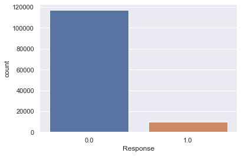
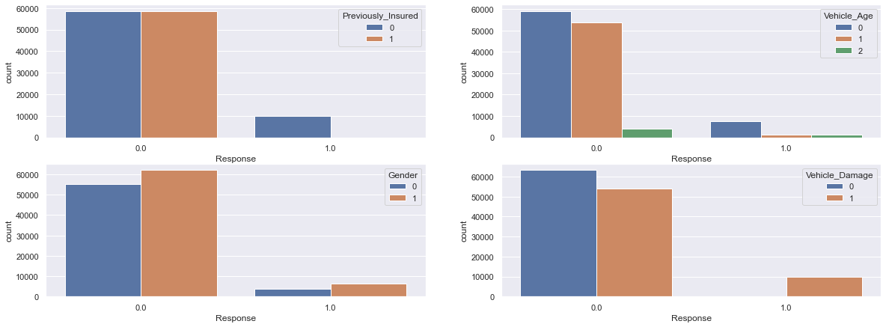
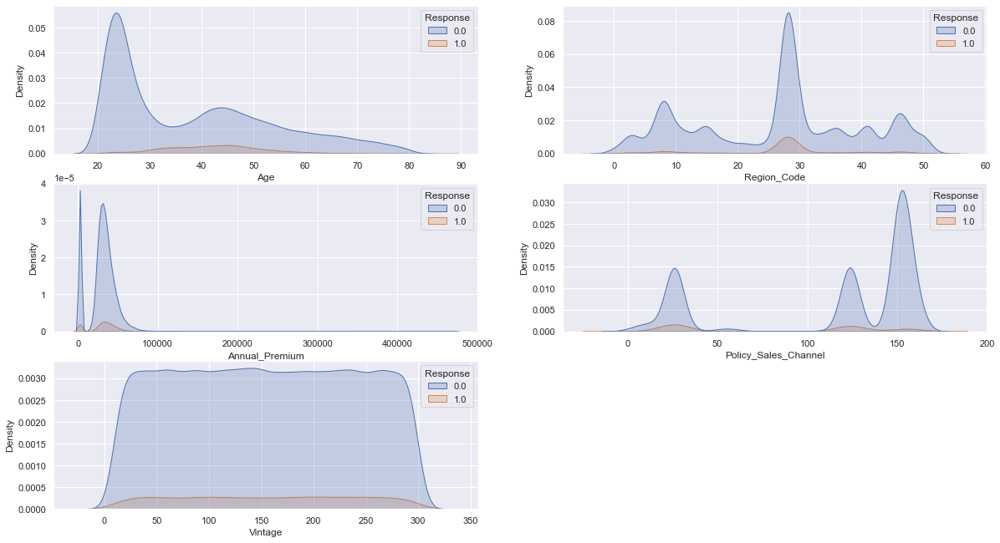

## Health Insurance Cross Sell Prediction

### Section 1: Project Overview

**Project Goal:** Predict Health Insurance Owners' who will be interested in Vehicle Insurance

 

**Data source:** https://www.kaggle.com/datasets/anmolkumar/health-insurance-cross-sell-prediction

 

**Description:** This project is to build a model to predict whether a health insurance owner would be interested in purchasing a Vehicle Insurance. The prediction is helpful because company can plan its communication strategy to reach out to those customers and optimize its business model and revenue.

 

**Data Dictionary:**

| Variable | Definition |
| --- | --- |
| id | Unique ID for the customer |
| Gender | Gender of the customer |
| Age | Age of the customer |
| Driving_License | 0: Customer does not have DL, 1: Customer already has DL |
| Region_Code | Unique code for the region of the customer |
| Previously_Insured | 1: Customer already has Vehicle Insurance, 0: Customer doesn't have Vehicle Insurance |
| Vehicle_Age | Age of the Vehicle |
| Vehicle_Damage | 1: Customer got his/her vehicle damaged in the past. 0: Customer didn't get his/her vehicle damaged in the past |
| Annual Premium | The amount customer needs to pay as premium in the year |
| PolicySalesChannel | Anonymized Code for the channel of outreaching to the customer ie. Different Agents, Over Mail, Over Phone, In Person, etc. |
| Vintage | Number of Days, Customer has been associated with the company |
| Response | 1: Customer is interested, 0: Customer is not interested |

 

**Evaluation Metric:** ROC_AUC score

 

### Section 2: Exploratory Data Analyis (EDA)

 

**Correlation Plot:**

We observe that previously_insured is a relatively stronger correlated variable to Response. Policy_Sales_Channel has a relatively strong correlation with Age. However, there is overall no strong relationship among variables.

 

**Plot Predictor variable:**

We observe a class imbalance here. We will need to use oversampling method to ensure classes are balance.

 

**Plot Categorical variable:**

We observe most participants have driver's license. We can consider remove this variable.

 

**Plot Numerical variable:**

We observe that the Age and Annual Premium is right skewed.

 

**Plot Categorical Bivariate Analysis:**

We observe that people who had vehicle damage are more likely to purchase insurance. Also, people who were not previously insured are more likely to purchase insurance.

 

**Plot Numerical Bivariate Analysis:**

We observe that younger participants tend to reject insurance.

 

### Section 3: Machine Learning Models

We first create baseline models to see which models are doing better. The AUC score of models are shown below:

| ID | Model | AUC Score |
| --- | --- | --- |
| 1 | Logistic Regression | 0.7773 |
| 2 | Random Forest Classifier | 0.9488 |
| 3 | Gradient Boosting Classifier | 0.8193 |
| 4 | K Nearest Neighbor (KNN) Classifier | 0.8494 |
| 5 | XGBoost Classifier | 0.8334 |
| 6 | ExtraTrees Classifier | 0.9712 |
| 7 | AdaBoost Classifier | 0.8213 |
| 8 | Voting Classifier | 0.9635 |

We decided to perform GridSearch Tuning for three models: (1) Random Forest Classifier, (2) ExtraTrees Classifier, and (3) Voting Classifier. The results are shown below:

| ID | Model | AUC Score |
| --- | --- | --- |
| 1 | Random Forest Classifier | 0.9488 |
| 2 | ExtraTrees Classifier | 0.9713 |
| 3 | Voting Classifier | 0.9637|

 

### Section 4: Visualization on Test Set

 

**Plot Test Predictor variable:**

 

**Plot Test Categorical Bivariate Analysis:**

 

**Plot Test Numerical Bivariate Analysis:**

 

## Section 5: Conclusion

The winner model is ExtraTrees Classifier with a ROC score of 0.9713. So, we used the algorithm to predict the repsonse on test set. We performed bivariate analysis on the predicted response and found that the algorithm targeted some participant groups for response 1:

(1) Previously insured
 
(2) Had vehicle damage

So, these are the participant groups the marketing team should put more focus on.
