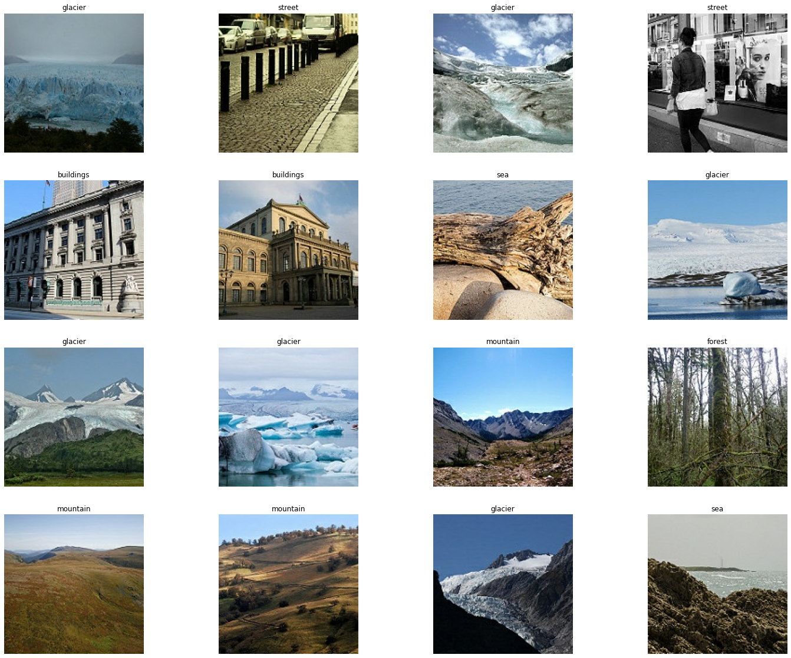
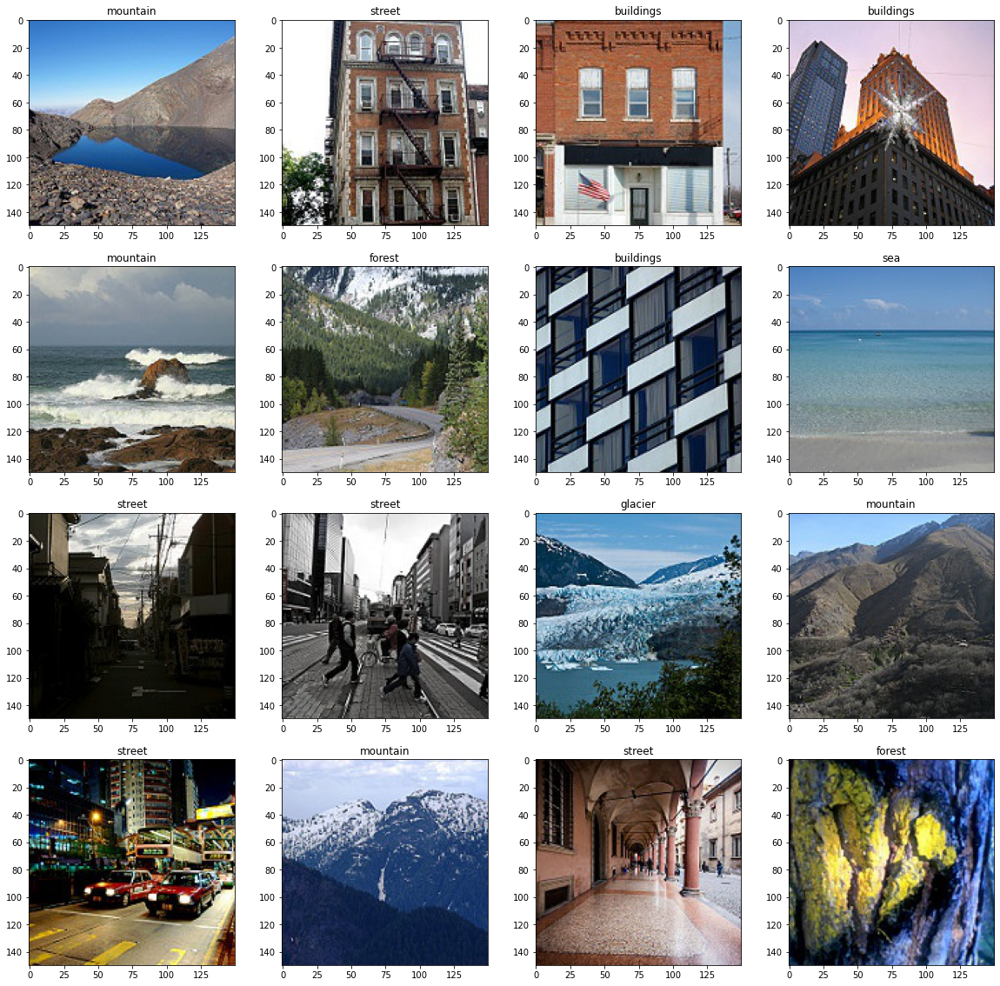

## CNN for Image Classification

This is a practice for building a Convolutional Neural Network (CNN) model to perform image classification task. There are 24k images in the dataset: For 14k images in training set, 3k images in test set, 7k images in prediction set. The images are about the natural scenes around the world. The images are 150x150 and are distributed under 6 categories:

 

- Buildings -> 0
- Forest -> 1
- Glacier -> 2
- Mountain -> 3
- Sea -> 4
- Street -> 5

 

The training images are shown below:

 

The image classification steps are shown below:

 

- At first, data augmentation is performed.
- Then, the CNN model is trained to classified the images to categories.
- The model is used to perform prediction.
- Our model show an accuracy rate of 72.5% on the test set.

 

The prediction are shown below:

