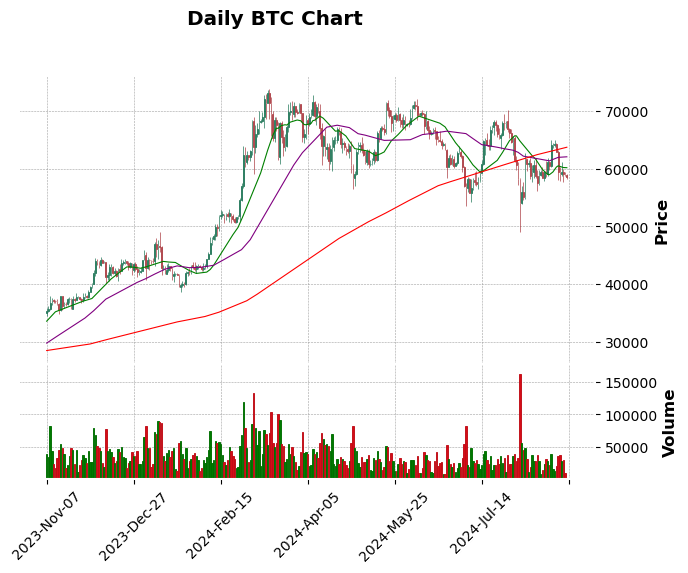
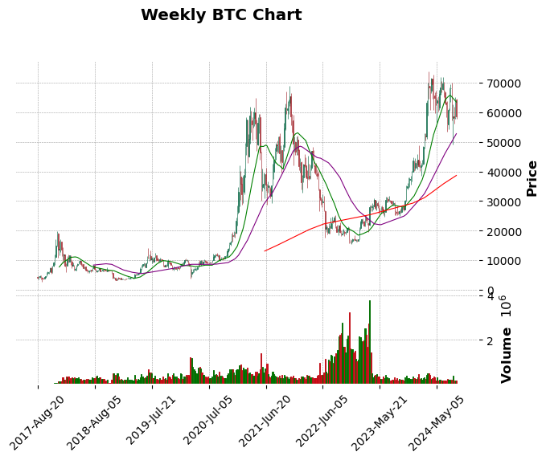
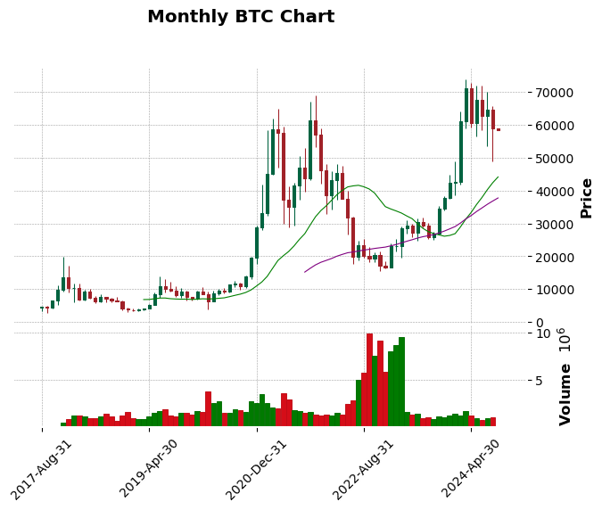
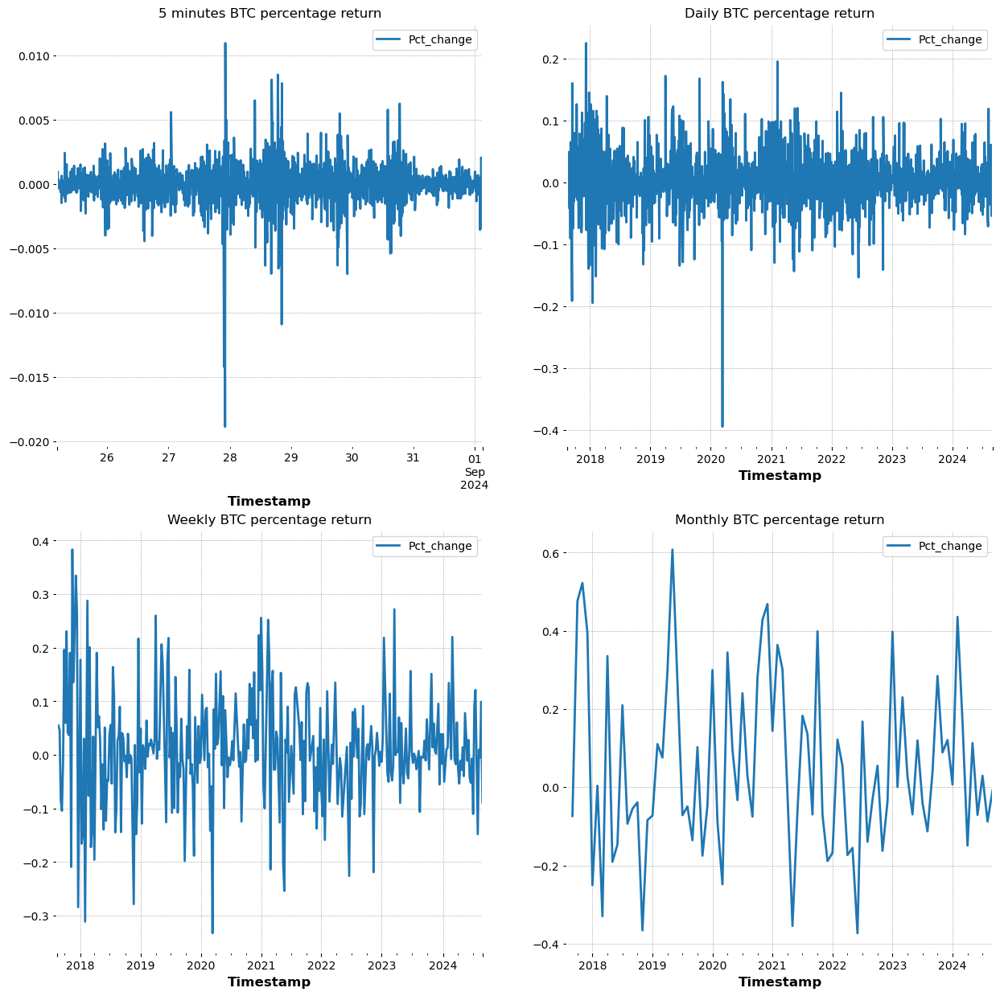
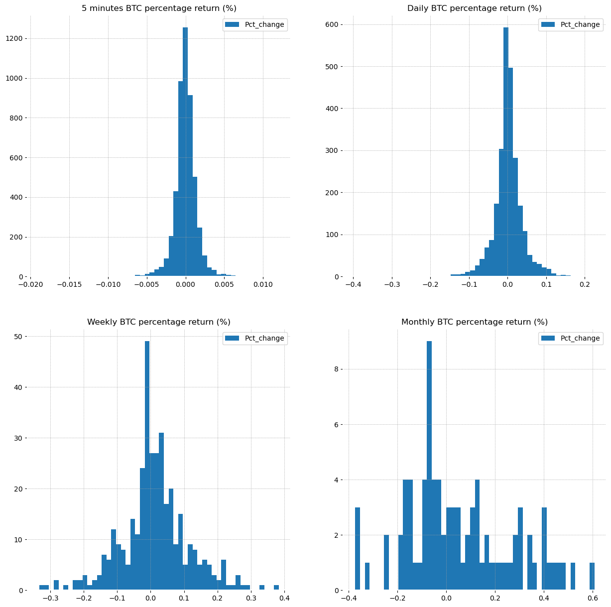

# LSTM Time-series recurrent neural network (RNN) model

## Overview

- LSTM, long short-term memory, is a type of recurrent neural network (RNN) that is capable of learning long-term dependencies.
- It is developed to overcome the limitations of traditional RNNs, such as the vanishing gradient problem, which makes it difficult for RNNs to learn from long sequences.

**Data Dictionary**

| Variable | Definition |
| --- | --- |
| timestamp | Date and minute |
| open | Price at the beginning of the minute |
| high | Highest price within the minute |
| low | Lowest price within the minute |
| close | Price at the end of the minute |
| volume| Trading volume (amount) |
| close_time | Closing timestamp |
| quote_asset_volume| Trading volume (value) |
| number_of_trades | Number of trades |
| taker_buy_base_asset_volume| Taker buy volume (amount) |
| taker_buy_quote_asset_volume | Taker buy volume (value) |
| ignore | Unused field |

 

In this dataset, we have data for 1-minute interval from 8/17/2017 04:00:00 up to 09/01/2024 03:00:00.

## Section 1. Data Transformation

The original dataset is in 1-minute interval. We created 5min, hourly, daily, weekly, and monthly datasets.

 
The dataset length is shown below:
- 5_min dataset length: 740725
- Hourly dataset length: 61728
- Daily dataset length: 2573
- Weekly dataset length: 368
- Monthly dataset length: 86

 
Also, we created 20, 50, 200 moving average variables in the datasets.

 
Then, we created a percentage change variable to calculate the change of close price between timestamps.

## Section 2. Data Visualization

The daily, weekly, and monthly BTC charts are created. On these charts, 20ma is plotted in green line, 50ma is plotted in purple line, and 200ma is plotted in red line. 

 

Also, the percentage return against timestamp plots are created as shown below. We can see that BTC is a volatile assets, as in some extreme days, BTC has percentage change of 20-40% in price.

Also, the percentage return histograms are created as shown below. We can see that the price change for 5-minute, daily, and weekly intervals are in normal distribution. The monthly percentage return chart looks like slightly right-skewed.

