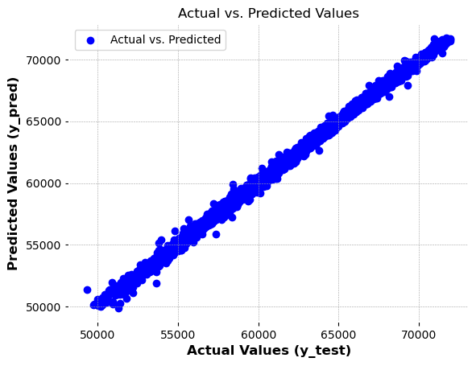
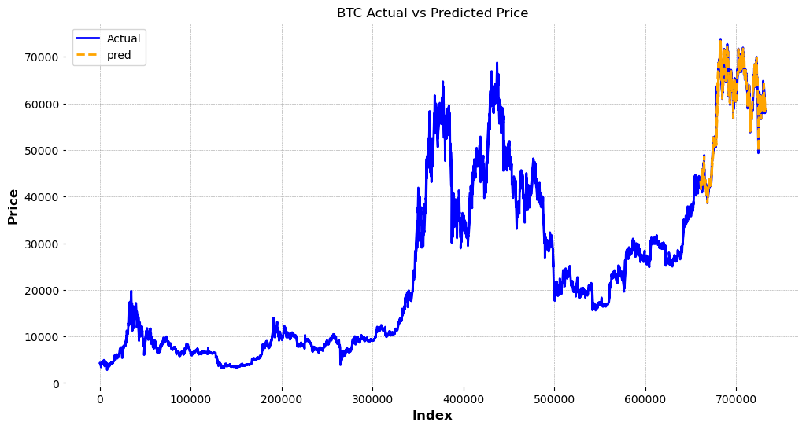
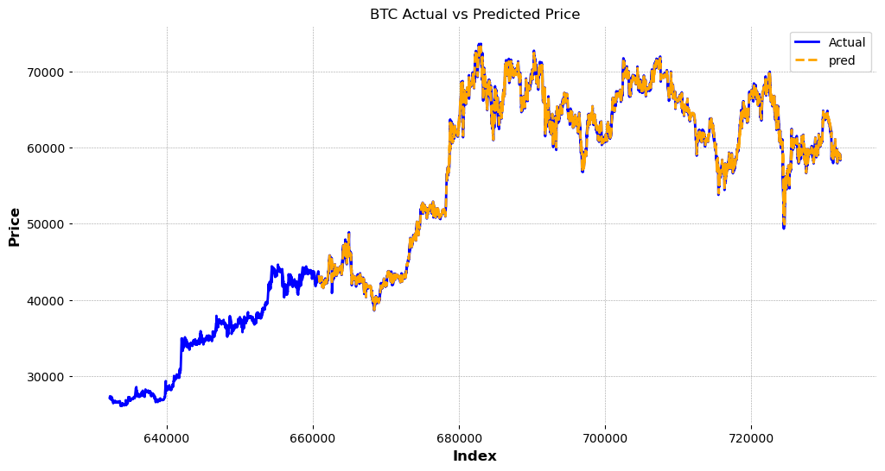

# LSTM Time-series recurrent neural network (RNN) model

## Overview

- LSTM, long short-term memory, is a type of recurrent neural network (RNN) that is capable of learning long-term dependencies.
- It is developed to overcome the limitations of traditional RNNs, such as the vanishing gradient problem, which makes it difficult for RNNs to learn from long sequences.

 

**Data Dictionary**

| Variable | Definition |
| --- | --- |
| timestamp | Date and minute |
| open | Price at the beginning of the minute |
| high | Highest price within the minute |
| low | Lowest price within the minute |
| close | Price at the end of the minute |
| volume| Trading volume (amount) |
| close_time | Closing timestamp |
| quote_asset_volume| Trading volume (value) |
| number_of_trades | Number of trades |
| taker_buy_base_asset_volume| Taker buy volume (amount) |
| taker_buy_quote_asset_volume | Taker buy volume (value) |
| ignore | Unused field |

 

In this dataset, we have data for 1-minute interval from 8/17/2017 04:00:00 up to 09/01/2024 03:00:00.

## Section 1. Data Transformation

The original dataset is in 1-minute interval. We created 5min, hourly, daily, weekly, and monthly datasets.

 
The dataset length is shown below:

- 5_min dataset length: 740725
- Hourly dataset length: 61728
- Daily dataset length: 2573
- Weekly dataset length: 368
- Monthly dataset length: 86

 
Also, we created 20, 50, 200 moving average variables in the datasets, and a percentage change variable to calculate the change of close price between timestamps.

 

## Section 2. Data Visualization

The daily, weekly, and monthly BTC charts are created. On these charts, 20ma is plotted in green line, 50ma is plotted in purple line, and 200ma is plotted in red line. 

 

Also, the percentage return against timestamp plots are created as shown below. We can see that BTC is a volatile assets, as in some extreme days, BTC has percentage change of 20-40% in price.

Also, the percentage return histograms are created as shown below. We can see that the price change for 5-minute, daily, and weekly intervals are in normal distribution. The monthly percentage return chart looks like slightly right-skewed.

## Section 3. LSTM model prediction

In this model, the predictors variables are: Close, Volume, MA20, MA50, and MA200. We use the historical data of these variables to predict the future BTC close price.

 
predictor_list = ['Close', 'Volume', 'MA20', 'MA50', 'MA200']

 
target_list = ['Close']

 
n_lag is set to be the lag timeframe. In our case, n_lag = 30 means we used 30 of 5-minutes lag, up to current data t=0. 

 
n_predict is the prediction timeframe. In our case, n_predict = 1 means we predict one 5-minute timeframe, also known as t=1.

 
We first split the dataset into 95% for trainval dataset and 5% for test set. Then, we use MinMaxScaler to fit transform the trainval dataset and apply the scaler to transform the test set. We done it for both predictors and target list.
After that, we split the trainval dataset to 95% train and 5% val. The dataset length are shown below:

- X_train shape: (660796, 155)
- Y_train shape: (660796, 1)
- X_val shape: (34779, 155)
- Y_val shape: (34779, 1)
- X_test shape: (36610, 155)
- Y_test shape: (36610, 1)

The Predicted vs Actual vs Predicted plots are shown below. The model has a mean absolute error (MAE) of x for validation set and x for test set.

## Section 3. Conclusion

- In this notebook, we used LSTM model for the 5-minute interval prediction for Bitcoin price.
- The variables n_lag = 30, and n_predict = 1 can be changed to expand the prediction interval. For example, using n_lag = 1, n_predict = 1 means to use one 5-minute historical data to predict one 5-minute future price.
- These lag/predict variables, as well as the LSTM model parameters can be changed to tune the model performance.
