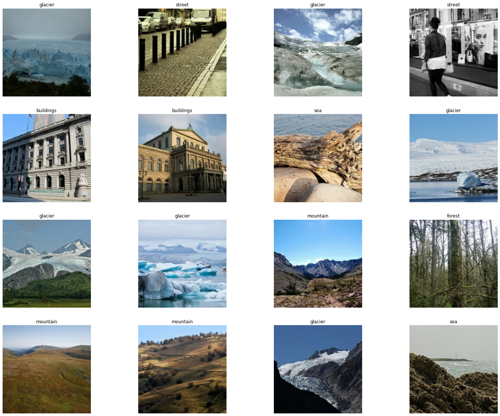
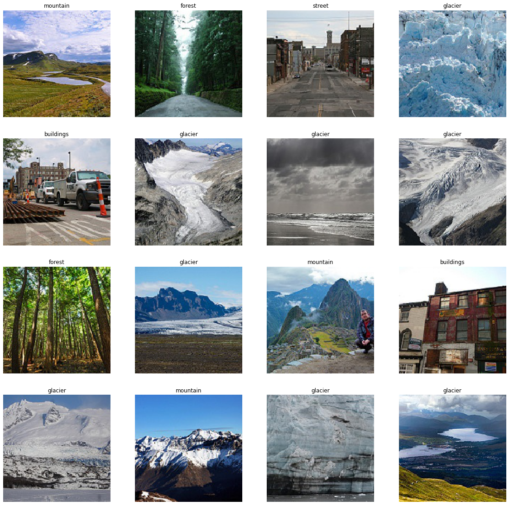

## Overview -- MobileNetV2

- MobileNetV2 is a convolutional neural network architecture designed for efficient mobile and embedded vision applications. It was introduced by Google in 2018 as an improvement over the original MobileNet architecture, with a focus on reducing computational complexity while maintaining high accuracy.
- MobileNetV2 is designed to run on devices with limited computational resources, such as smartphones and IoT devices. It achieves a good balance between accuracy and efficiency.
- Fine-tuning is a technique in machine learning and deep learning where a pre-trained model is adapted to perform a new, often related task. This process involves taking a model that has already been trained on a large dataset (such as ImageNet for image classification) and retraining it on a new dataset that is usually smaller or more specific to the task at hand.

 

In this practice, we will perform a fine tuning for MobileNet_V2 for a image classification task.

 

There are 24k images in the dataset: For 14k images in training set, 3k images in test set, 7k images in prediction set. The images are about the natural scenes around the world. The images are 150x150 and are distributed under 6 categories:

Buildings -> 0
Forest -> 1
Glacier -> 2
Mountain -> 3
Sea -> 4
Street -> 5

 

The training images are shown below:

The image classification steps are shown below:

- At first, data augmentation is performed.
- Then, we include the MobileNetV2 architecture and weights as our base model.
- We retrain the entire model to improve the model accuracy.
- The model is used to perform prediction.
- Our model show an accuracy rate of 87.3% on the test set.

 

The prediction are shown below:

