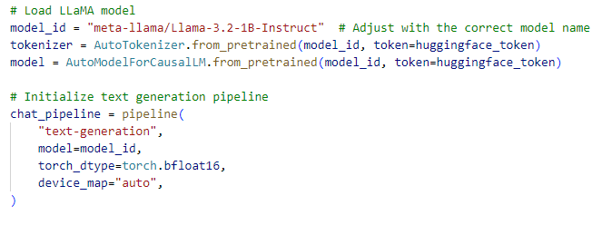
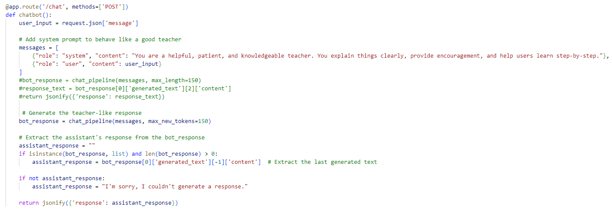
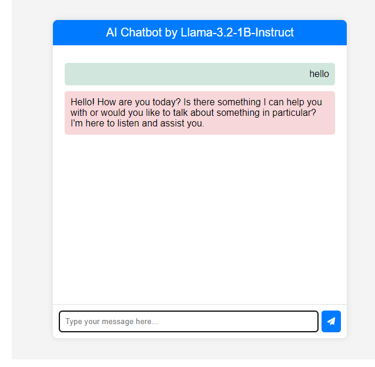
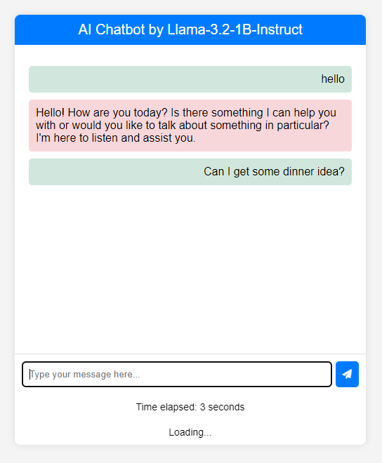
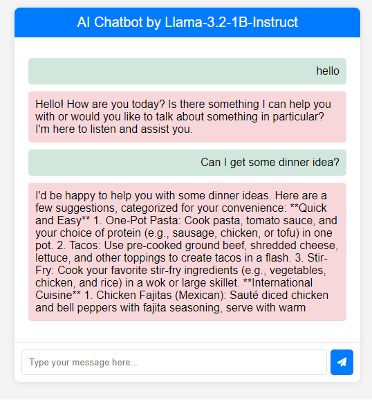

# Building a Chatbot with using Llama-3.2-1B-Instruct model

**Overview:** This is part of the features in my personal website, which I built a chatbot using the Llama-3.2-1B-Instruct model from Hugging Face

**Model Link:** https://huggingface.co/meta-llama/Llama-3.2-1B-Instruct

**Steps:**
1. First, we need to get an access token from hugging face to access the model and import it into the website. In the python script, the model id needs to be defined, including a pipeline function.

2. Then, we need to set up a chatbot function to give instruction to the model. The code includes a 'system' role for the instruction and a 'user' role for the user input. The model will generate a third role, along with the content, we need get the content and use it as the chatbot output.

3. After that, we need to build an interface for the chatbot. We use html and javascript for that. Link:
- <a href="chat.js">chat.js</a>
- <a href="chatbot.html">chatbot.html</a>

5. The example uses are shown below:

