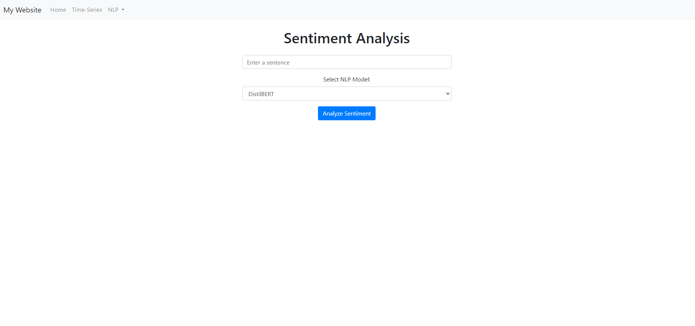
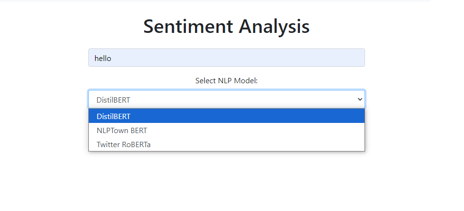
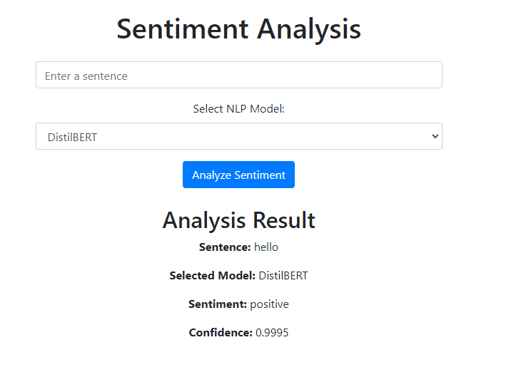
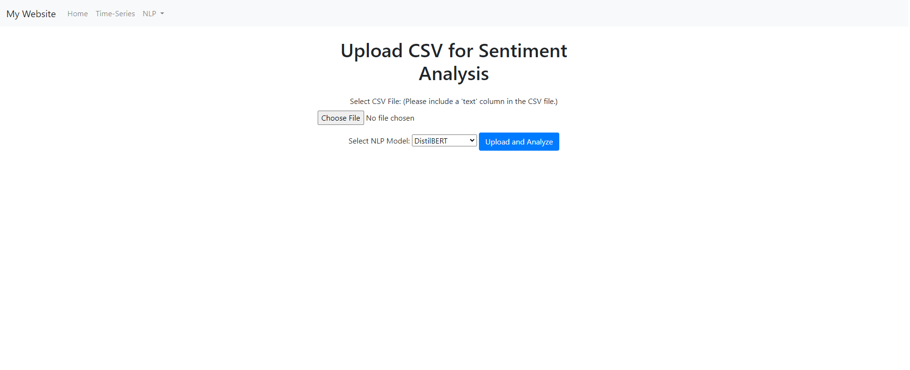
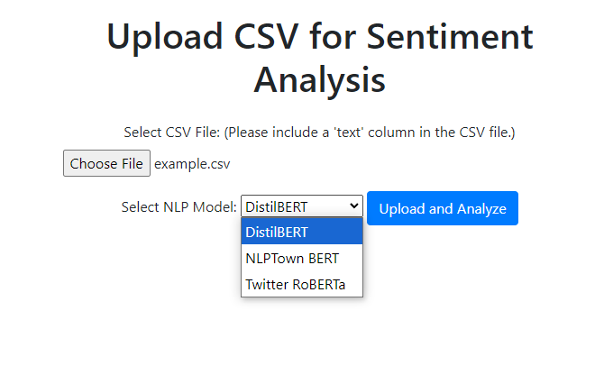
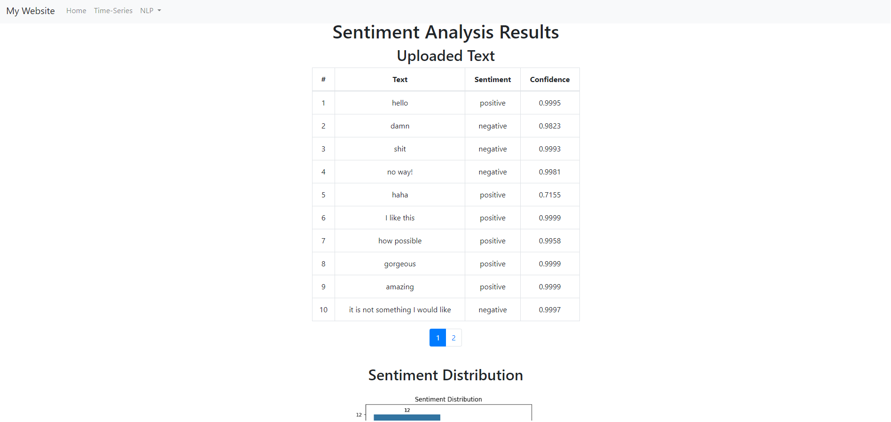
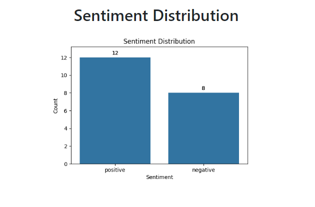
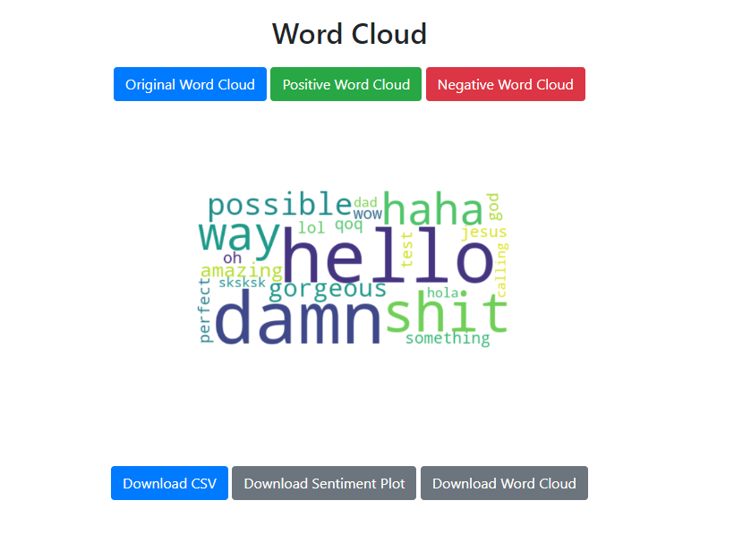
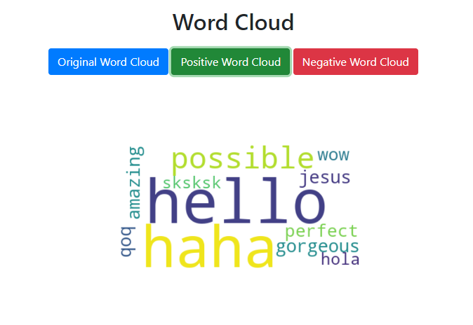
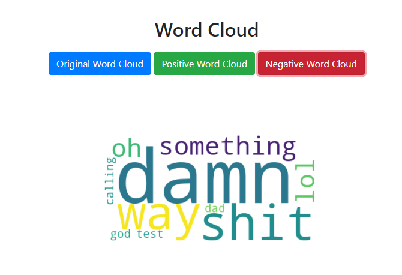

## Sentiment Analysis

**Overview:** This part includes two features of sentiment analysis (1) Simple sentence, (2) CSV file upload for batch analysis. There are three NLP models available for selection when analyzing the sentence and for CSV file.

**Model Link:**
- <a href="https://huggingface.co/distilbert/distilbert-base-uncased-finetuned-sst-2-english">distilbert-base-uncased-finetuned-sst-2-english</a>
- <a href="https://huggingface.co/nlptown/bert-base-multilingual-uncased-sentiment">bert-base-multilingual-uncased-sentiment</a>
- <a href="https://huggingface.co/cardiffnlp/twitter-xlm-roberta-base-sentiment">twitter-xlm-roberta-base-sentiment</a>

 

### Part 1. Simple sentence sentiment analysis

1. The sentence analysis interface is shown below:

 

2. The user should input a word or a setence into the text box, then proceed to selecting a NLP model.

3. Then click on the "Analyze Sentiment" button, the sentiment analysis result will shown below

### Part 2. CSV file upload sentiment analysis

1. The sentence analysis CSV file upload interface is shown below:
   

 

2. The user should upload a CSV file with a 'text' column, then proceed to selecting a NLP model.
   

 

3. The sentence analysis result interface is shown below:

 

4. There is a sentiment distribution chart showing the result of the CSV file.

5. There is a WordCloud showing the result of the CSV file. User can select a filter for positive/negative wordcloud.

6. The user can also download any of the plots shown above.
