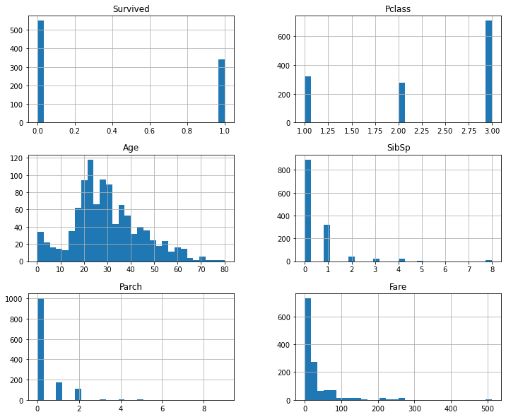
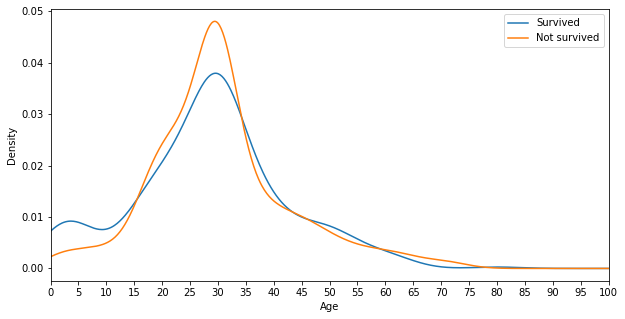
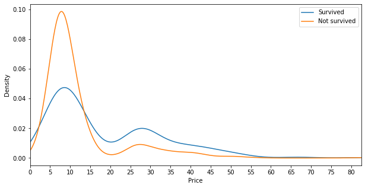
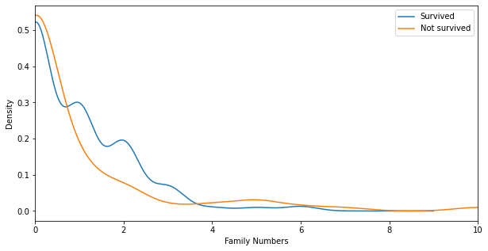

## Titanic: Machine Learning from Disaster

This is a dataset from Kaggle where data professionals are required to training machine learning models to predict if the passengers in the test set will survive from the disaster. 

**Data Dictionary**
 
| Variable | Definition |
| --- | --- |
| survival | Survival 0=No, 1=Yes |
| pclass | Ticket class 1=1st, 2=2nd, 3=3rd |
| sex | Sex |
| age | Age in years |
| sibsp | # of siblings / spouses aboard the Titanic |
| parch | # of parents / children aboard the Titanic |
| ticket | Ticket number |
| fare | Passenger fare |
| cabin | Cabin number |
| embarked | Port of Embarkation C=Cherbourg, Q=Queenstown, S=Southampton |

 

**Variable Notes**  

pclass: A proxy for socio-economic status (SES)  
1st = Upper  
2nd = Middle  
3rd = Lower  
age: Age is fractional if less than 1. If the age is estimated, is it in the form of xx.5  
sibsp: The dataset defines family relations in this way...  
Sibling = brother, sister, stepbrother, stepsister  
Spouse = husband, wife (mistresses and fiancés were ignored)  
parch: The dataset defines family relations in this way...  
Parent = mother, father  
Child = daughter, son, stepdaughter, stepson  
Some children travelled only with a nanny, therefore parch=0 for them.  

**Data Visualization**  

The plots show the distributions of the variables. We observe the right skew on the passenger age. Also, there is an outlier in the ticket fare variable.

**Data Transformation**  
A few data transformation is done on this dataset.  
1. Fill Age missing values  
2. Create column CabinGroup using first letter of Cabin  
3. Examine the survival rate of Cabin Groups
4.  Create column price = ticket number / number of passenger with same number
5.  Imputed fare price outliers with mean price
6.  Create column FamilyOnBoard to calculate the number to family members

 

Interestingly, the cabin groups with its survival rate is shown below:

| Cabin Group | Value Count | Survival Rate |
| --- | --- | -- |
| N | 1014 | 0.300 |
| C | 94 | 0.593 |
| B | 65 | 0.745 |
| D | 46 | 0.758 |
| E | 41 | 0.750 |
| A | 22 | 0.467 |
| F | 21 | 0.615 |
| G | 5 | 0.500 |
| T | 1 | 0.000 |

 

Also, we examined the correlation of 'Survived' variable with other variables:

| Survived | Correlation |
| --- | --- |
| Survived | 1.000 |
| Price | 0.270 |
| Fare | 0.252 |
| Parch | 0.082 |
| FamilyOnBoard | 0.017 |
| SibSp | -0.035 |
| Age | -0.070 |
| Pclass | -0.338 |

 

A few plots are created to examine the relationship betweent the survival rate and the variables: 

(1) Survived vs Age

(2) Survived vs Price

(3) Survived vs Family members

Lastly, 
