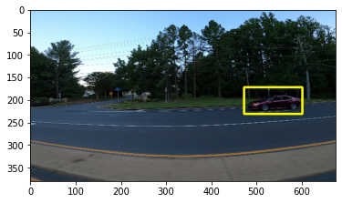

## Overview -- yolov5

- YOLOv5 (You Only Look Once, version 5) is an open-source object detection model known for its speed and accuracy.
- It is designed for real-time object detection, meaning they can identify and locate objects within images or videos in a single pass through the network, making them extremely fast.
- YOLOv5 provides pre-trained models that can be used as is or fine-tuned for specific tasks. This makes it possible to achieve good performance on custom object detection tasks without needing large amounts of data or computational resources
- In our use case, we use the pre-trained yolov5 model to detect cars on the road.

**Example image:**

**Statistical result:**

**Prediction:**

The model prediction can be applied to the video: <a href="https://github.com/ychong4/ychong4.github.io/blob/master/Activity%202/yolov5/car.mp4" target="_blank">video</a>

